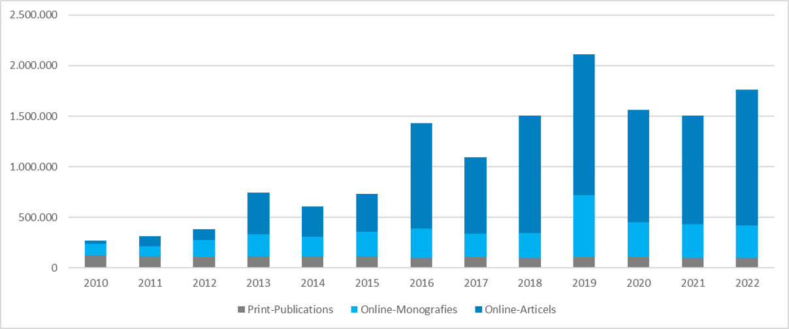
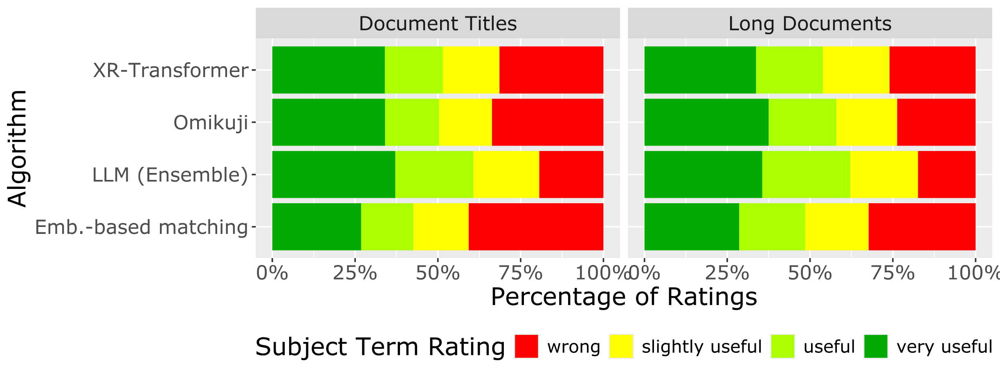
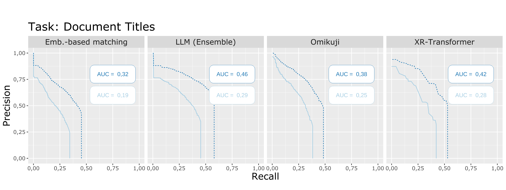

```{r}
#| label: setup
#| message: false
#| warning: false
#| echo: FALSE
knitr::opts_chunk$set(
  echo = TRUE, message = FALSE, warning = FALSE, cache = TRUE,
  fig.path = "figures/"
  )

library(knitr)
library(tidyverse)
library(casimir)
options(casimir.ignore_inconsistencies = TRUE)
```

```{r}
#| label: read-data
#| echo: FALSE
#| cache: true

source("../src/load_data.r")

```

# Introduction

## Welcome 

  Welcome to the Workshop on **Evaluating Automated Subject Indexing Methods**

::: {style="display: flex; gap: 40px; justify-content: center; margin-bottom: 2em;"}

::: {style="background: white; color: black; padding: 24px; border-radius: 12px; box-shadow: 0 2px 8px rgba(0,0,0,0.08); min-width: 391px; max-width: 460px; height: 410px;"}
  **About me:** 

  * Maximilian Kähler, German National Library (DNB)
  * education: mathematics & theoretical physics
  * project lead for DNB-AI-Project on advancing automated subject indexing 
:::

::: {style="background: white; color: black; padding: 24px; border-radius: 12px; box-shadow: 0 2px 8px rgba(0,0,0,0.08); min-width: 391px; max-width: 460px; height: 410px;"}
  **About this Workshop:**

  * Explore evaluation techniques for evaluating automated subject indexing methods, focusing on practical applications using the **CASIMiR**[^casimir] package.
  * Created as part DNB-AI-Project, funded by the German Federal Commissioner for Culture and Media (BKM) [^bkm]
  * All workshop materials are available online[^workshop-materials] 
   
:::

:::

[^casimir]: [https://github.com/deutsche-nationalbibliothek/casimir](https://github.com/deutsche-nationalbibliothek/casimir)
[^bkm]: [https://kulturstaatsminister.de/#](https://kulturstaatsminister.de/#)
[^workshop-materials]: [https://github.com/deutsche-nationalbibliothek/casimir-workshop](https://github.com/deutsche-nationalbibliothek/casimir-workshop)

## Why Automated Subject Indexing?



  * increasing publication volume
  * limited human resources for manual subject indexing
  * need for consistent and scalable indexing methods

## Automated Subject Indexing@DNB

  * In production since 2014
  * Complete refactorization of software architecture in 04/2022 [^Poley2025]
  * Core component is the open source library <a href="https://annif.org/" style="vertical-align:middle;"></a>[^Suominen2019]
  * Annual throughput of ~170.000 publications per year
  * Our target vocabulary is the Integrated Authority File[^gnd] (GND) containing >1.4M potential concepts

[^Poley2025]: Poley etal. 2025. “Automatic Subject Cataloguing at the German National Library.” <br>
  [https://doi.org/10.53377/lq.19422](https://doi.org/10.53377/lq.19422)
[^Suominen2019]: Suominen 2019. “Annif: DIY Automated Subject Indexing Using Multiple Algorithms.” <br>
  [https://doi.org/10.18352/lq.10285](https://doi.org/10.18352/lq.10285).

## Why subject Indexing is hard

  * very large label sets (thousands to millions of labels)
  * very sparse label assignments (only few correct labels per document)
  * incomplete ground truth (not all correct labels are assigned in manual indexing)
  * hierarchical relationships between labels (some labels are more general/specific than others)
  * varying importance of labels (some labels are more important than others for a given document)


## Improving Automated Subject Indexing

Three complementary approaches:
<br><br>

::: r-vstack
::: {data-id="box1" auto-animate-delay="0" style="background: #0046c4; width: 800px; height: 150px; margin: 10px; display: flex; align-items: center; padding-left: 40px;"}
  Find and write better algorithms for keyword extraction
:::


::: {data-id="box2" auto-animate-delay="0.1" style="background: #a4b900; width: 800px; height: 150px; margin: 10px; align-items: center; display: flex; padding-left: 40px;"}
  Reduce the complexity of the problem
:::

::: {data-id="box3" auto-animate-delay="0.2" style="background: #e62e2e; width: 800px; height: 150px; margin: 10px; align-items: center; display: flex; padding-left: 40px;"}
  Get better at diagnosing good keyword extraction
:::
:::
 


# Methods for Subject Indexing

## An Overview

Before the advent of Deep Learning and transformers:
<br>

  * Lexical Matching [^1]^,^[^2]  

  * Statistical Methods for Extreme Multi-Label Classification (XMLC):[^Bhatia16]^,^[^Dasgupta2023]
    * 1vsAll classifiers [^3]
    * Partitioned Label Trees [^4]^,^[^5]^,^[^6]  

2 and 6 are backends of <a href="https://annif.org/" style="vertical-align:middle;"></a><br>

[^1]: Medelyan, O., Frank, E., & Witten, I. H. (2009). 
    Human-competitive tagging using automatic keyphrase extraction. 
[^2]: Maui-like Lexical Matching  
    [https://github.com/NatLibFi/Annif/wiki/Backend%3A-MLLM](https://github.com/NatLibFi/Annif/wiki/Backend%3A-MLLM)
[^3]: Schultheis, E. and Babbar, R. (2021) “Speeding-up One-vs-All Training for Extreme Classification via Smart Initialization.” Available at: [https://doi.org/10.48550/arxiv.2109.13122](https://doi.org/10.48550/arxiv.2109.13122)
[^4]: Khandagale, S., Xiao, H., & Babbar, R. (2020). 
   Bonsai: diverse and shallow trees for extreme multi-label classification. 
[^5]: Prabhu, Y., Kag, A., Harsola, S., Agrawal, R., & Varma, M. (2018). 
   Parabel: Partitioned label trees for extreme classification 
   with application to dynamic search advertising
[^6]: Omikuji Rust-Library: [https://github.com/tomtung/omikuji](https://github.com/tomtung/omikuji)
[^Bhatia16]: Bhatia etal. 2016. “The Extreme Classification Repository: Multi-Label Datasets and Code.” [http://manikvarma.org/downloads/XC/XMLRepository.html](http://manikvarma.org/downloads/XC/XMLRepository.html).
[^Dasgupta2023]: Dasguptaetal. 2023. “Review of Extreme Multilabel Classification,” February. [https://arxiv.org/abs/2302.05971v2](https://arxiv.org/abs/2302.05971v2).

## Lexical Matching 



  * can match any keyword in the vocabulary
  * heuritstics like frequency, position, etc. are used to rank the keywords after matching


## Statistical Methods



* statistical apporaches learn correlations between feature matrix and document-label matrix
* statistical apporaches don't need prefLabels: they do not interpret the description of labels

## After the invention of transformers I

Refitting old methods with transformers:

  * Lexical Matching → Embedding Based Matching [^7]
    * performs matching in embedding space rather than lexically
  * Statistical Methods:
    * Partitioned Label Trees → X-Transformer [^8]
    * represent document features with transformer embeddings rather than only TFIDF


[^7]: DND-Prototype: [https://github.com/deutsche-nationalbibliothek/ebm4subjects](https://github.com/deutsche-nationalbibliothek/ebm4subjects)
[^8]: Zhang etal. (2021). Fast Multi-Resolution Transformer Fine-tuning for Extreme Multi-label Text Classification.
  [https://arxiv.org/abs/2110.00685v2](https://arxiv.org/abs/2110.00685v2)

## After the invention of transformers II

Going for generative LLM-powered methods:

  * prompt LLMs to generate keywords for documents
  * use few-shot prompting to guide LLMs towards desired behavious
  * map generated keywords to controlled vocabulary

<div style="display: flex; align-items: center; justify-content: center; gap: 48px; margin: 2em 0;">
  <div style="background: #0046c4; color: white; padding: 32px 48px; border-radius: 16px; font-size: 1.5em; font-weight: bold; box-shadow: 0 2px 8px rgba(0,0,0,0.08);">
    Few-Shot-Prompting
  </div>
  <div style="font-size: 2.5em; font-weight: bold; color: #222;">+</div>
  <div style="background: #a4b900; color: black; padding: 32px 48px; border-radius: 16px; font-size: 1.5em; font-weight: bold; box-shadow: 0 2px 8px rgba(0,0,0,0.08);">
    Mapping
  </div>
</div>


## The idea of few shot prompting



  * exploits world knowledge in LLMs
  * needs only few training examples

## Mapping

  * LLM has no knowledge of controlled vocabulary
  * extra step maps generated keywords to controlled vocabulary
  * hybrid search: lexical matching + embedding based matching powered by vector storage



## Advanced LLM-based methods

Few-shot prompting and mapping alone do not yield satisfactory results yet
  
--> Advanced methods:
    
  * combine multiple LLM-based methods into an **LLM-ensemble**[^9]
  * use LLMs to Rank and filter candidate labels from multiple methods
  * use retrieval to augment LLM prompts with relevant context[^10]

[^9]: Kluge, L. and Kähler, M. (2025) “DNB-AI-Project at SemEval-2025 Task 5: An LLM-Ensemble Approach for Automated Subject Indexing,” [https://aclanthology.org/2025.semeval-1.148/](https://aclanthology.org/2025.semeval-1.148/).
[^10]: Kähler, M., Kluge, L. and Konermann, K. (2025) “DNB-AI-Project at the GermEval-2025 LLMs4Subjects Task: KIFSPrompt - Knowledge-Injected Few-Shot Prompting,” [https://aclanthology.org/2025.konvens-2.42/](https://aclanthology.org/2025.konvens-2.42/).

## Methods: Summary

5 Methods we work with today:

  {width="80%"}

**Your task:** identify which method is behind which anonymised name[^credit-icons]

<div style="display: flex; justify-content: center; align-items: flex-end; gap: 32px; margin-top: 2em; margin-bottom: 2em;">
  <figure style="text-align: center;">
    
    <figcaption>Artful Accordion</figcaption>
  </figure>
  <figure style="text-align: center;">
    
    <figcaption>Bold Bassoon</figcaption>
  </figure>
  <figure style="text-align: center;">
    
    <figcaption>Charming Cello</figcaption>
  </figure>
  <figure style="text-align: center;">
    
    <figcaption>Dreamy Didgeridoo</figcaption>
  </figure>
  <figure style="text-align: center;">
    
    <figcaption>Embracing Euphonium</figcaption>
  </figure>
</div>

[^credit-icons]: <a href="https://www.flaticon.com/free-icons/" title="cello icons">Icons created by Freepik - Flaticon</a>

::: {.notes}
Speaker notes go here.
:::

# Datasets for this Workshop

## Titles and Vocabulary

Document Titles:

  * German National Library (DNB) Test Set
    * 8.415 document titles with manual subject indexing
    * German scientific literature from 18 selected subject groups in equal proportions
  * Available at: `data/` folder in this repository
  * `data/README.md` contains descriptions of all dataset files

Vocabulary:
  
  * ~200K unique concepts, subsetted from the Integrated Authority File (GND)[^gnd]
  * each subject heading has a unique identifier (`label_id`) and a preferred label (`label_text`)
  * the GND includes subject headings, geographic headings, personal names, corporate names, and more

[^gnd]: https://gnd.network/

## Predictions

  * methods are anonymized for unbiased evaluation
  * Predictions from 5 different methods provided under `data/test-set_predictions/`:
    * `artful-accordion.csv`
    * `bold-bassoon.csv`
    * `charming-cello.csv`
    * `dreamy-didgeridoo.csv`
    * `embracing-euphonium.csv`
  * key-columns are `doc_id` for document identifiers and `label_id` for GND subject headings,
    which are expected by CASIMiR functions
  * every suggested label also has a `score` between 0 and 1 indicating the confidence of the method

::: {style="background: #ff9800; color: black; padding: 20px; border-radius: 10px; font-size: 1.2em; margin: 20px 0;"}
**Workshop Game:** 

Can you guess which method is behind which file name?
:::

## Practical I

  **Practical:** Go to `workbooks/01_inspecting-results-manually.qmd` to inspect the
   data formats and datasets provided.

::: {style="background: #e62e2e; color: white; padding: 20px; border-radius: 10px; font-size: 1.2em; margin: 20px 0;"}
**Warning**: English translations of document titles and GND subject labels are created by generative AI
  and provided for convenience only. They may contain errors or inaccuracies. Keyword-Suggestions are all based on subject indexing methods applied to German text and German labels. 
:::

<div style="background: white; color: black; padding: 24px; border-radius: 12px; box-shadow: 0 2px 8px rgba(0,0,0,0.08); margin: 24px 0;">
  <span style="font-size: 2em;">💡</span> If you speak German use the <code>_ger</code> column names in the code examples
  instead of the <code>_eng</code> variants to see the original German texts.
</div>

## Practical I: Example

```{r}
#| label: create-qual-table
#| message: false
#| warning: false
#| echo: false

source("../src/create_qual_table.r")

doc_titles <- read_csv(
  "../data/test-set_doc-ids-and-titles_w-translation.csv"
)

gnd_pref_labels <- read_csv("../data/gnd_pref-labels_w-translation.csv")
gold_standard_w_labels <- gold_standard |> 
  left_join(gnd_pref_labels, by = "label_id")

set.seed(42)
sample_docs <- sample_n(doc_titles, size = 1)

# modify `_eng` to `_ger` to see german original texts
qual_table <- create_qualitative_table(
  predicted = predictions,
  gold_standard = gold_standard,
  doc_id_list = select(sample_docs, doc_id),
  gnd = select(gnd_pref_labels, label_id, label_text = label_text_eng),
  title_texts = select(doc_titles, doc_id, title = doc_title_eng),
  limit = 5 # how many suggestions per method to consider?
)

qual_table
```

# Evaluation of Subject Indexing Methods

<!-- ## Evaluation Checklist

  * which methods to compare
  * which data to use for evaluation
    * training data/test data split
    * dimensions of data (subject groups, languages, document types)
  * which metrics to use for evaluation  -->
 

## Metric Basics

We work mostly in the **binary relevance scenario**: Comparing predictions to a goldstandard

|                | Goldstandard yes | Goldstandard no | |
|----------------|-----------------|-------------------|--|
| **Prediction<br> yes**  | true positives (`tp`) | false positives (`fp`) | <span style="color: #0046c4; white-space: nowrap;">$\mathrm{Prec} = \frac{tp}{tp + fp}$</span> |
| **Prediction<br> no** | false negatives (`fn`) | true negatives (`tn`) | |
|                | <span style="color: #a4b900;">$\mathrm{Rec} = \frac{tp}{tp + fn}$</span> | |  |

<br>

::: {style="display: flex; justify-content: center; gap: 40px;"}

::: {style="background: #a4b900; color: black; padding: 20px; border-radius: 10px; min-width: 320px; max-width: 320px; display: flex; flex-direction: column; align-items: center;"}

**Recall**

How many of the expected gold standard labels were actually suggested?
:::

::: {style="background: #0046c4; color: white; padding: 20px; border-radius: 10px; min-width: 320px; max-width: 320px; display: flex; flex-direction: column; align-items: center;"}
**Precision**

How many of the suggested labels are actually correct?
:::

:::

## Example: Document Level Precision and Recall

Consider the following example document title:

>Media habitus and biographical legend - <br>
 Writerly performance practices in the age of digitalization

:::: {.columns}

::: {.column width="80%"}

:::

::: {.column width="20%"}
$$
\mathrm{Prec} = \frac{1}{1 + 4} = 0.2
$$
$$
\mathrm{Rec} = \frac{1}{1 + 1} = 0.5
$$
:::

::::


  * tp = 1 (Authorship)
  * fp = 4 (Literature, Performance, Writer, Digitalization)
  * fn = 1 (Self-presentation)
  * tn = Vocab-Size - 6 (all other labels not suggested and not in goldstandard)

## Metrics Basics: continued

  * Precision and Recall can be computed on different aggregation levels:
    * per document
    * per label
    * overall (micro/macro averaged)
  * Precision and Recall can be combined into F1-Score:
  
  $$\mathrm{F1} = 2 \cdot \frac{\mathrm{Prec} \cdot \mathrm{Rec}}{\mathrm{Prec} + \mathrm{Rec}}$$

  * In subject indexing, when results are ranked by a confidence score,we are often interested in top-k suggestions:
    * Precision@k, Recall@k, F1@k
    * e.g. how many of the top-5 suggestions are correct?

  <!-- * Precision and Recall are often referred to as "Set Retrieval Metrics" as they do
    not account for the ranking of the suggested labels 
  * "Ranked Retrieval Metrics" like Mean Average Precision (MAP) or Normalized Discounted Cumulative Gain (NDCG) can be used to evaluate the ranking of suggested labels (not covered in this workshop) -->

## Practical II

  **Practical:** Go to `workbooks/02_set-retrieval-metrics.qmd` to compute
   retrieval metrics for the provided subject indexing methods.

Example: Compute Precision, Recall, and F1-Score for `artful-accordion` method

```{r}
#| label: compute-metrics-one-method

compute_set_retrieval_scores(
  predicted = predictions[["artful-accordion"]],
  gold_standard = gold_standard,
  k = 5, # limit to top-5 suggestions
  rename_metrics = TRUE
)

```

## Practical III: Dimensions of Evaluation

Datasets often have multiple **document-based** dimensions that can be used for
 stratified evaluation:

  * subject groups
  * document types
  * languages
  * publication years

Alternatively: Stratify along **vocabulary-based** dimensions:

  * entity types (e.g., topics, places, persons)
  * subject groups
  * hierarchical levels
  * frequent vs. rare labels

**Practical:** Go to `workbooks/03_stratified-set-retrieval-metrics.qmd` to explore
 stratified evaluation using different dimensions of the provided datasets.

## Practical III: Example

Given the mapping table `subject_groups` that assigns each document to a subject group,
we can compute stratified retrieval scores:

```{r}
#| label: load-subject-groups
#| echo: FALSE

subject_groups <- read_csv("../data/test-set_subject-group-mapping.csv",
                           col_select = c(
                            "doc_id", "sg", "sg_label_ger", "sg_label_eng"),
                            show_col_types = FALSE)  |>
                    mutate(
                      sg_label_eng = as.factor(case_when(
                        sg %in% c("940", "943") ~ "History of Germany and Europe",
                        TRUE ~ sg_label_eng
                      )),
                      sg_label_ger = as.factor(case_when(
                        sg %in% c("940", "943") ~ "Geschichte Deutschlands und Europas",
                        TRUE ~ sg_label_ger
                      )),
                      sg = as.factor(case_when(
                        sg %in% c("940", "943") ~ "940/943",
                        TRUE ~ sg
                      ))
                    )

```

```{r}
#| label: stratified-subject-groups
res_at_5_by_sg_artful_accordion <- compute_set_retrieval_scores(
  predicted = predictions[["artful-accordion"]],
  gold_standard = gold_standard,
  doc_groups = subject_groups,
  k = 5
)

kable(head(res_at_5_by_sg_artful_accordion, 3))

```

## Precision-Recall Curves

So far: set retrieval metrics at fixed `k = 5`

:::: {.columns}

::: {.column width="50%"}
```{r}
#| label: define-prec-rec-rank
#| echo: false
#| fig.width: 5
#| fig.height: 5.5

# compute precision and recall at k for method artful-accordion
prec_rec_rank <- function(k) {
  res_at_k <- compute_set_retrieval_scores(
    predicted = predictions[["artful-accordion"]],
    gold_standard = gold_standard,
    k = k
  )  

  # simplify output to only precision and recall
  res <- res_at_k  |>
    filter(metric %in% c("prec", "rec"))  |>
    select(metric, value)  |>
    pivot_wider(names_from = metric, values_from = value)  |>
    select(prec, rec)  |>
    mutate(k = k)

  res
}

k_range <- c(1,2,3,4,5,10)
prec_rec_rank_df <- map_dfr(k_range, prec_rec_rank)

library(ggrepel)

ggplot(prec_rec_rank_df, aes(x = rec, y = prec)) +
  geom_path(color = "red") +
  geom_point() +
  geom_text_repel(
    aes(label = paste0("k = ", k)), 
    min.segment.length = 1,
    dircetion = "x",
    vjust = -1, hjust = -1) +
  coord_fixed(xlim = c(0, 1), ylim = c(0, 1)) +
  labs(
    title = "Precision-Recall at varying k",
    x = "Recall",
    y = "Precision"
  )

```
:::

::: {.column width="50%"}
```{r}
#| label: define-prec_rec_threshold
#| echo: false
#| fig.width: 5
#| fig.height: 5.5

prec_rec_threshold <- function(threshold) {
  # filter predictions by threshold
  predictions_thresholded <- predictions[["artful-accordion"]] |>
    filter(score >= threshold)
  
  # compute precision and recall at threshold
  res_at_threshold <- compute_set_retrieval_scores(
    predicted = predictions_thresholded,
    gold_standard = gold_standard,
  )  

  # simplify output to only precision and recall
  res <- res_at_threshold  |>
    filter(metric %in% c("prec", "rec"))  |>
    select(metric, value)  |>
    pivot_wider(names_from = metric, values_from = value)  |>
    select(prec, rec)  |>
    mutate(threshold = threshold)

  res
}

threshold_range <- seq(0, 1, by = 0.1)
prec_rec_threshold_df <- map_dfr(threshold_range, prec_rec_threshold)

ggplot(prec_rec_threshold_df, aes(x = rec, y = prec)) +
  geom_path(color = "red") +
  geom_point() +
  geom_text_repel(
    aes(label = paste0("t = ", round(threshold, 2))), 
    hjust = -1, vjust = -1) +
  coord_fixed(xlim = c(0, 1), ylim = c(0, 1)) + 
  labs(
    title = "Precision-Recall Curve at varying thresholds",
    x = "Recall",
    y = "Precision"
  )
 

```
:::

::::

Precision-Recall curves show the trade-off between precision and recall at different thresholds


## Practical IV: Precision Recall Curves

  **Practical:** Go to `workbooks/04_precision-recall-curves.qmd` to compute
   precision-recall curves for the provided subject indexing methods.

Example: Compute Precision-Recall Curve with CASIMiR

```{r}
#| label: prec-rec-casimir
#| eval: false

pr_curve <- compute_pr_curve(
  predicted = predictions[["artful-accordion"]],
  gold_standard = gold_standard,
  steps = 10 # number of thresholds to evaluate
)

ggplot(pr_curve$plot_data, aes(x = rec, y = prec_cummax)) +
  geom_point() +
  geom_path() +
  coord_fixed(xlim = c(0, 1), ylim = c(0, 1)) + 
  ggtitle("Precision-Recall Curve for artful-accordion, computed with CASIMiR")
```

## Analysing the long tail

```{r}
#| label: plot-long-tail
#| fig.width: 8
#| fig.heihgt: 5
#| echo: FALSE

# load training frequency distribution for GND labels
train_freqs <- read_csv("../data/training-frequency-distribution.csv",
                        show_col_types = FALSE)  |>
                # add total number of training documents
                mutate(n_docs = 1e7) 

freq_groups <- train_freqs  |>               
                mutate(freq_group = cut(x = label_freq,
                          breaks = c(0, 1, 10, 100, 1000, 10000, Inf),
                          labels = c("x == 0",
                                     "1 <= x < 10",
                                     "10 <= x < 100",
                                     "100 <= x < 1000",
                                     "1000 <= x < 10000",
                                     "10000 <= x"
                          ),
                          right = FALSE, include_lowest = TRUE))  |>
                  select(-label_freq)

freq_groups |> 
  filter(freq_group != "x == 0") |>
  group_by(freq_group) |> 
  summarise(n_labels = n()) |> 
  ggplot(aes(x = freq_group, y = n_labels)) + 
  geom_col(fill = "lightblue", color = "black") +
  geom_text(aes(label = prettyNum(n_labels, big.mark = " ")), vjust = -0.5) +
  labs(
    title = "Frequency distribution of GND labels in the training data",
    x = "x - Number of training documents per label",
    y = "Number of labels"
  )
```

## Practical V: Long Tail Analysis

  **Practical:** Go to `workbooks/05_analysing-the-long-tail.qmd` to analyse
   performance of subject indexing methods on frequent vs. rare labels.

## Practical VI: Final Assignment

  **Practical:** Go to `workbooks/06_final-assignment.qmd` and try to solve todays quiz:

  **Your task:** identify which method is behind which anonymised name[^credit-icons]

<div style="display: flex; justify-content: center; align-items: flex-end; gap: 32px; margin-top: 2em; margin-bottom: 2em;">
  <figure style="text-align: center;">
    
    <figcaption>Artful Accordion</figcaption>
  </figure>
  <figure style="text-align: center;">
    
    <figcaption>Bold Bassoon</figcaption>
  </figure>
  <figure style="text-align: center;">
    
    <figcaption>Charming Cello</figcaption>
  </figure>
  <figure style="text-align: center;">
    
    <figcaption>Dreamy Didgeridoo</figcaption>
  </figure>
  <figure style="text-align: center;">
    
    <figcaption>Embracing Euphonium</figcaption>
  </figure>
</div>

## Solution: Methods Revealed

<div style="font-size: 0.7em;">
  | Instrument | Method Name |
  |------------|-------------|
  | Artful Accordion | Lexical Matching  |
  | Bold Bassoon | LLM-Ensemble |
  | Charming Cello | X-Transformer |
  | Dreamy Didgeridoo | Embedding Based Matching |
  | Embracing Euphonium | Omikuji (TFIDF-based Statistical Method) |
</div>

Haven't found your favourite method? 

Consider combining them into **ensembles** for improved performance![^orchestra-icon]

<div style="display: flex; justify-content: center;">
  
</div>

[^orchestra-icon]:<a href="https://www.flaticon.com/free-icons/orchestra" title="orchestra icons">Orchestra icons created by mia elysia - Flaticon</a>

# Advanced Topics

## Bonus: Conditional label weights

Do true, positives, false positive and false negatives mean the same to us?

We can assign different costs to different types of errors:

|                | Goldstandard yes | Goldstandard no |
|----------------|-----------------|-------------------|
| **Prediction yes**  | $C_{\text{tp}}\cdot \text{tp}$ | $C_{\text{fp}}\cdot\text{fp}$ |
| **Prediction no** | $C_{\text{fn}}\cdot\text{fn}$ | $C_{\text{tn}}\cdot\text{tn}$ |

Assume label dependent costs for true positives and false negatives:

$$C_{\text{tp}} = C_{\text{fn}} = w_{\lambda},$$

and constant costs for false positives:

$$C_{\text{fp}} = \textit{const}$$

where $w_{\lambda}$ is a weight depending on label $\lambda$, inversely proportional to its frequency in the training data.

## Bonus: Conditional label weights II

```{r}
#| label: propensity-scored-metrics-conditional
#| cache: true
#| echo: false


res_propensity <- map_dfr(
  predictions,
  ~ compute_set_retrieval_scores(
    predicted = .x,
    gold_standard = gold_standard,
    mode = "doc-avg",
    k = 5,
    propensity_scored = TRUE,
    label_distribution = train_freqs,
    cost_fp_constant = "mean"
  ),  .id = "method"
)  |>
  filter(metric == "f1") 

res_no_weights <- map_dfr(
  predictions,
  ~ compute_set_retrieval_scores(
    predicted = .x,
    gold_standard = gold_standard,
    mode = "doc-avg",
    k = 5,
  ),  .id = "method"
)  |>
  filter(metric == "f1") 

plot_data <- bind_rows(
  res_propensity  |>
    mutate(weighting = "weighted"),
  res_no_weights  |>
    mutate(weighting = "not_weighted")
)  |>
  pivot_wider(names_from = weighting, values_from = value)

 library(ggrepel)

ggplot(plot_data, aes(x = not_weighted, y = weighted, color = method, label = method)) +
  geom_point() +
  geom_abline(slope = 1, intercept = 0, linetype = "dashed", color = "gray") +
  geom_text_repel() +
  coord_fixed(xlim = c(0, 0.5), ylim = c(0, 0.5)) +
  labs(
    title = "F1@5 with and without propensity scoring",
    x = "F1@5 without weighting",
    y = "F1@5 with propensity scoring"
  )
```

## Bonus: Beyond binary relevance I

Revisit the earlier example document title:

>Media habitus and biographical legend - <br>
 Writerly performance practices in the age of digitalization





  * Incomplete ground truth: not all correct labels are assigned in manual indexing
  * false positives may actually still be helpful suggestions


## Bonus: Beyond binary relevance II

Graded relevance levels can be used to model this, e.g.: 

<div style="font-size: 0.6em;">
| Ordinal Relevance Level | 
| ----------------------  | 
| very helpful |
| helpful      | 
| slightly helpful |
| wrong  | 
</div>

{width="90%"}

## Generalized Precision and Recall

Graded relevance leads to the notion of **generalised precision** and  **generalised recall**[^Kekalainen2002]

<div style="font-size: 0.6em;">
| Ordinal Relevance Level | Metric Relevance Level $r$ |
| ----------------------  | ---------------------- |
| very helpful | 1 |
| helpful      | 2/3 |
| slightly helpful | 1/3 |
| wrong  | 0 |
</div>

::: {style="display: flex; gap: 40px; justify-content: center; margin: 2em 0;"}

::: {style="background: #0046c4; color: white; padding: 24px; border-radius: 12px; min-width: 320px; text-align: center;"}
**Generalised Precision**  
$$
\frac{tp + \Delta_{rel}}{tp + fp}
$$
:::

::: {style="background: #a4b900; color: black; padding: 24px; border-radius: 12px; min-width: 320px; text-align: center;"}
**Generalised Recall**  
$$
\frac{tp + \Delta_{rel}}{tp + fn + \Delta_{rel}}
$$
:::

:::

with $\Delta_{rel} = \sum_{i \in false\ positives} r_i$  with metric relevance ratings $0 \leq r_i \leq 1$

[^Kekalainen2002]: Kekäläinen, Jaana, and Kalervo Järvelin. 2002. “Using Graded Relevance Assessments in IR Evaluation.” Journal of the American Society for Information Science and Technology 53 (November): 1120–29. https://doi.org/10.1002/asi.10137.

## Generalized Precision and Recall Curves

Generalised precision-recall curves can be computed similarly to standard precision-recall curves (also supported in CASIMiR):



# Discussion

## Discussion

**Your opinion:**

What other aspects of subject indexing methods should we evaluate?

::: {.notes}
  - computational efficiency/ hardware requirements
  - interpretability of results (easy algorithm vs. black-box LLM)
  - open source vs. proprietary software
:::

# The End

## Thank you!
<br><br>

### Contact

**Maximilian Kähler**

German National Library

:::: { .column width=50% }
[m.kaehler@dnb.de](mailto:m.kaehler@dnb.de)<br>
[https://www.dnb.de](https://www.dnb.de)
<span class="fa fa-mastodon" aria-label="Mastodon" style="margin-right: 0.5em;"></span>
[\@mfakaehler@openbiblio.social](https://openbiblio.social/\@mfakaehler)

::::
