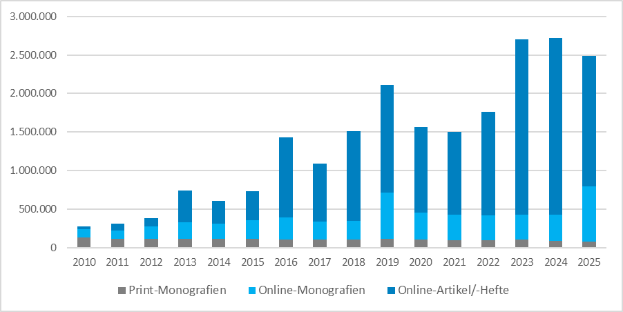
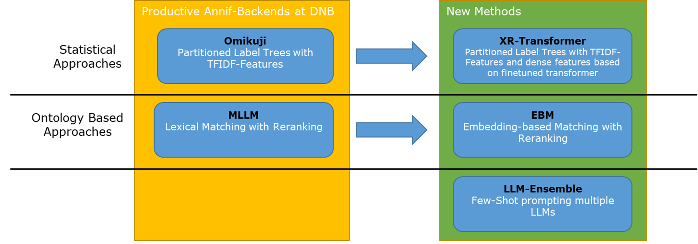

```{r}
#| label: setup
#| message: false
#| warning: false
#| echo: FALSE
knitr::opts_chunk$set(
  echo = TRUE, message = FALSE, warning = FALSE, cache = TRUE,
  fig.path = "figures/ger/"
  )

library(knitr)
library(tidyverse)
library(casimir)
options(casimir.ignore_inconsistencies = TRUE)
```

```{r}
#| label: read-data
#| echo: FALSE
#| cache: true

source("../src/load_data.r")

```

## Willkommen...

  ...zum Workshop: **Evaluierung automatischer Verfahren zur Inhaltserschließung** 
  
::: {style="display: flex; gap: 40px; justify-content: center; margin-bottom: 2em;"}

::: {style="background: white; color: black; padding: 24px; border-radius: 12px; box-shadow: 0 2px 8px rgba(0,0,0,0.08); min-width: 391px; max-width: 460px; height: 410px;"}
  **Über mich:**

  * Maximilian Kähler, Deutsche Nationalbibliothek (DNB)
  * Ausbildung: Mathematik & Theoretische Physik
  * Projektverantwortlicher für das DNB-KI-Projekt zur Weiterentwicklung automatischer Erschließung
:::

::: {style="background: white; color: black; padding: 24px; border-radius: 12px; box-shadow: 0 2px 8px rgba(0,0,0,0.08); min-width: 391px; max-width: 460px; height: 410px;"}
  **Über diesen Workshop:**

  * Techniken zur Evaluation automatischer Inhaltserschließungsverfahren mit Fokus auf praktische Anwendungen des **CASIMiR**[^casimir]-Pakets.
  * Entwickelt im Rahmen des DNB-AI-Projekts, gefördert vom Bundesbeauftragten für Kultur und Medien (BKM) [^bkm]
  * Alle Workshop-Materialien sind online verfügbar[^workshop-materials]
   
:::

:::

[^casimir]: [https://github.com/deutsche-nationalbibliothek/casimir](https://github.com/deutsche-nationalbibliothek/casimir)
[^bkm]: [https://kulturstaatsminister.de/#](https://kulturstaatsminister.de/#)
[^workshop-materials]: [https://github.com/deutsche-nationalbibliothek/casimir-workshop](https://github.com/deutsche-nationalbibliothek/casimir-workshop)

# Einleitung

## 

```{=html}
<div id='toc'></div>
```

## Warum automatische Sacherschließung?

  {width="80%"}

  * wachsendes Publikationsvolumen
  * begrenzte personelle Kapazitäten für manuelle Sacherschließung
  * Bedarf an konsistenten und skalierbaren Indexierungsverfahren

## Automatische Indexierung an der DNB


  * Indexierung produktiv seit 2014
  * Vollständige Überarbeitung der Software-Architektur im April 2022 [^Poley2025]
  * Kernkomponente ist die Open-Source-Bibliothek <a href="https://annif.org/" style="vertical-align:middle;"></a>[^Suominen2019]
  * Jährlicher Durchsatz von ca. 170.000 Publikationen pro Jahr
  * Unser Zielvokabular ist die GND[^gnd] (Gemeinsame Normdatei), die über 1,4 Mio. potenzielle Konzepte enthält

[^Poley2025]: Poley et al. 2025. “Automatic Subject Cataloguing at the German National Library.” <br>
  [https://doi.org/10.53377/lq.19422](https://doi.org/10.53377/lq.19422)
[^Suominen2019]: Suominen 2019. “Annif: DIY Automated Subject Indexing Using Multiple Algorithms.” <br>
  [https://doi.org/10.18352/lq.10285](https://doi.org/10.18352/lq.10285).

## Warum automatische Sacherschließung schwierig ist

  * sehr große Vokabulare wie die GND oder LCSH (Tausende bis Millionen von Labels)
  * sehr spärliche Annotationen (nur wenige korrekte Labels pro Dokument)
  * stark ungleichmäßige Label-Verteilungen (einige Labels sind sehr häufig, andere sehr selten)
  * unvollständige Ground Truth-Daten (nicht alle korrekten Labels werden bei der manuellen Erschließung zugewiesen)
  * hierarchische Beziehungen zwischen Labels (manche Labels sind allgemeiner/spezifischer als andere)
  * ...

::: {.notes}

  * usage of subject term, label, subject heading mostly interchangeable in this talk
  
:::

## Verbesserung der automatischen Sacherschließung

Drei ergänzende Ansätze:
<br><br>

::: r-vstack
::: {data-id="box1" auto-animate-delay="0" style="background: #0046c4; width: 800px; height: 150px; margin: 10px; display: flex; align-items: center; padding-left: 40px; color: white;"}
  Bessere Algorithmen für die automatische Indexierung finden und schreiben
:::


::: {data-id="box2" auto-animate-delay="0.1" style="background: #a4b900; width: 800px; height: 150px; margin: 10px; align-items: center; display: flex; padding-left: 40px; color: white;"}
  Die Komplexität des Problems reduzieren
:::

::: {data-id="box3" auto-animate-delay="0.2" style="background: #e62e2e; width: 800px; height: 150px; margin: 10px; align-items: center; display: flex; padding-left: 40px; color: white;"}
  **Besser darin werden, gute Schlagwortextraktion zu diagnostizieren**
:::
:::
 


# Methoden für die automatische Indexierung

## Überblick

Vor dem Aufkommen von Deep Learning und Transformers:
<br>

  * Lexikalische Verfahren [^1]^,^[^2]  
  * Statistische Verfahren für "Extreme Multi-Label Classification (XMLC)":[^Bhatia16]^,^[^Dasgupta2023]
    * 1vsAll Verfahren [^3]
    * Partitioned Label Trees [^4]^,^[^5]^,^[^6]  

2 and 6 are backends of <a href="https://annif.org/" style="vertical-align:middle;"></a><br>

[^1]: Medelyan, O., Frank, E., & Witten, I. H. (2009). 
    Human-competitive tagging using automatic keyphrase extraction. 
[^2]: Maui-like Lexical Matching  
    [https://github.com/NatLibFi/Annif/wiki/Backend%3A-MLLM](https://github.com/NatLibFi/Annif/wiki/Backend%3A-MLLM)
[^3]: Schultheis, E. and Babbar, R. (2021) “Speeding-up One-vs-All Training for Extreme Classification via Smart Initialization.” Available at: [https://doi.org/10.48550/arxiv.2109.13122](https://doi.org/10.48550/arxiv.2109.13122)
[^4]: Khandagale, S., Xiao, H., & Babbar, R. (2020). 
   Bonsai: diverse and shallow trees for extreme multi-label classification. 
[^5]: Prabhu, Y., Kag, A., Harsola, S., Agrawal, R., & Varma, M. (2018). 
   Parabel: Partitioned label trees for extreme classification 
   with application to dynamic search advertising
[^6]: Omikuji Rust-Library: [https://github.com/tomtung/omikuji](https://github.com/tomtung/omikuji)
[^Bhatia16]: Bhatia et al. 2016. “The Extreme Classification Repository: Multi-Label Datasets and Code.” [http://manikvarma.org/downloads/XC/XMLRepository.html](http://manikvarma.org/downloads/XC/XMLRepository.html).
[^Dasgupta2023]: Dasgupta et al. 2023. “Review of Extreme Multilabel Classification,” February. [https://arxiv.org/abs/2302.05971v2](https://arxiv.org/abs/2302.05971v2).

## Lexikalisches Matching


  * kann jedes Schlagwort im Vokabular zuordnen
  * Heuristiken wie Häufigkeit, Position usw. werden verwendet, um die Schlagwörter nach der Zuordnung zu bewerten


## Statistische Methoden



* statistische Ansätze lernen Korrelationen zwischen **Feature-Matrix** und **Dokument-Label-Matrix**
* statistische Ansätze benötigen keine prefLabels: Sie interpretieren die Beschreibung der Labels nicht

::: {.notes}

  * texts get processed into feature matrix
  * gold standard annotations get processed into document-label matrix 

:::


## Nach der Erfindung der Transformer I

Anpassung alter Methoden mit Transformers:

  * Lexikalisches Matching → Embedding-basiertes Matching [^7]
    * führt den Vergleich im Embedding-Raum durch, nicht lexikalisch
  * Statistische Methoden:
    * Partitioned Label Trees → X-Transformer [^8]
    * stellen Dokumentmerkmale (auch) mit Transformer-Embeddings dar, statt nur mit TFIDF


[^7]: DNB-Prototype: [https://github.com/deutsche-nationalbibliothek/ebm4subjects](https://github.com/deutsche-nationalbibliothek/ebm4subjects)
[^8]: Zhang et al. (2021). Fast Multi-Resolution Transformer Fine-tuning for Extreme Multi-label Text Classification.
  [https://arxiv.org/abs/2110.00685v2](https://arxiv.org/abs/2110.00685v2)

## Nach der Erfindung der Transformer II

Nutzung generativer KI-Methoden:

  * Prompt von LLMs zur Generierung von Schlagworten für Dokumente
  * Verwendung von Few-Shot-Prompting zur Steuerung des Verhaltens von LLMs
  * Mapping generierter Schlagwörter in ein kontrolliertes Vokabular

<div style="display: flex; align-items: center; justify-content: center; gap: 48px; margin: 2em 0;">
  <div style="background: #0046c4; color: white; padding: 32px 48px; border-radius: 16px; font-size: 1.5em; font-weight: bold; box-shadow: 0 2px 8px rgba(0,0,0,0.08);">
    Few-Shot-Prompting
  </div>
  <div style="font-size: 2.5em; font-weight: bold; color: #222;">+</div>
  <div style="background: #a4b900; color: black; padding: 32px 48px; border-radius: 16px; font-size: 1.5em; font-weight: bold; box-shadow: 0 2px 8px rgba(0,0,0,0.08);">
    Mapping
  </div>
</div>


## Die Idee des Few-Shot-Promptings



  * nutzt Weltwissen in LLMs
  * benötigt nur wenige Trainingsbeispiele
  
## Mapping

  * LLM hat kein Wissen über kontrolliertes Vokabular
  * zusätzlicher Schritt mappt generierte Schlagwörter in das kontrollierte Vokabular
  * Hybrid-Suche: lexikalisches Matching + embedding-basiertes Matching durch Vector Storage



## Fortgeschrittene LLM-basierte Methoden

Few-Shot-Prompting und Mapping allein ergeben noch keine zufriedenstellenden Ergebnisse.

--> Fortgeschrittene Methoden:

  * Kombination mehrerer LLM-basierter Methoden zu einem **LLM-Ensemble**[^9]
  * Verwendung von LLMs zum Sortieren und Filtern von Kandidatenlabels aus verschiedenen Methoden
  * Nutzung von Retrieval zur Ergänzung von LLM-Prompts mit relevantem Kontext[^10]

[^9]: Kluge, L. and Kähler, M. (2025) “DNB-AI-Project at SemEval-2025 Task 5: An LLM-Ensemble Approach for Automated Subject Indexing,” [https://aclanthology.org/2025.semeval-1.148/](https://aclanthology.org/2025.semeval-1.148/).
[^10]: Kähler, M., Kluge, L. and Konermann, K. (2025) “DNB-AI-Project at the GermEval-2025 LLMs4Subjects Task: KIFSPrompt - Knowledge-Injected Few-Shot Prompting,” [https://aclanthology.org/2025.konvens-2.42/](https://aclanthology.org/2025.konvens-2.42/).

## Zusammenfassung der Methoden

Wir betrachten heute fünf verschiedene Methoden:

  {width="80%"}

**Ihre Aufgabe:** finden Sie heraus, welches Verfahren hinter welchem anonymisierten Namen steht.[^credit-icons]

<div style="display: flex; justify-content: center; align-items: flex-end; gap: 32px; margin-top: 2em; margin-bottom: 2em;">
  <figure style="text-align: center;">
    
    <figcaption>Artful Accordion</figcaption>
  </figure>
  <figure style="text-align: center;">
    
    <figcaption>Bold Bassoon</figcaption>
  </figure>
  <figure style="text-align: center;">
    
    <figcaption>Charming Cello</figcaption>
  </figure>
  <figure style="text-align: center;">
    
    <figcaption>Dreamy Didgeridoo</figcaption>
  </figure>
  <figure style="text-align: center;">
    
    <figcaption>Embracing Euphonium</figcaption>
  </figure>
</div>

[^credit-icons]: <a href="https://www.flaticon.com/free-icons/" title="cello icons">Icons created by Freepik - Flaticon</a>

::: {.notes}
Speaker notes go here.
:::

# Datasets for this Workshop

## Titel und Vokabular

Dokumenttitel:

  * Testdatensatz der Deutschen Nationalbibliothek (DNB)
    * 8.415 Dokumenttitel mit intellektueller Schlagworterschließung
    * deutsche wissenschaftliche Literatur aus 18 ausgewählten Fachgruppen in gleichen Anteilen
  * Verfügbar im `data/`-Ordner dieses Repositories
  * `data/README.md` enthält Beschreibungen aller Datensatzdateien

Vokabular:

  * ~200K eindeutige Konzepte, Teilmenge der Gemeinsamen Normdatei (GND)[^gnd]
  * jedes Schlagwort hat eine eindeutige Kennung (`label_id`) und einen bevorzugten Schlagworttext (`label_text`)
  * die GND enthält Sachschlagwörter, Geografika, Personen, Körperschaften und mehr

[^gnd]: https://gnd.network/

## Maschinelle Vorschäge

  * Verfahren sind anonymisiert für eine unvoreingenommene Bewertung
  * Maschinelle Vorschläge von 5 verschiedenen Methoden sind unter `data/test-set_predictions/` verfügbar:
    * `artful-accordion.csv`
    * `bold-bassoon.csv`
    * ...
  * Schlüsselspalten sind `doc_id` für Dokumentkennungen und `label_id` für GND-Sachschlagwörter,
    welche von CASIMiR-Funktionen erwartet werden
  * bis zu 100 vorgeschlagene Dokument-Label-Paare pro Methode und Dokument
  * jedes vorgeschlagene Label besitzt auch eine `score` zwischen 0 und 1, welche die Konfidenzwerte der Methode angibt

::: {style="background: #ff9800; color: black; padding: 20px; border-radius: 10px; font-size: 1.2em; margin: 10px 0;"}
**Workshop-Spiel:**

Können Sie erraten, welche Methode hinter welchem Dateinamen steckt?
:::

## Übung I: Manuelle Inspektion

  **Übung:** Gehen Sie zu `workbooks/01_inspecting-results-manually.qmd`, um die
   Datentypen und Datensätze kennenzulernen.

<div style="background: white; color: black; padding: 24px; border-radius: 12px; box-shadow: 0 2px 8px rgba(0,0,0,0.08); margin: 24px 0;">
  <span style="font-size: 2em;">💡</span> If you don't speak German use the <code>_eng</code> column names in the code examples
  instead of the <code>_ger</code> variants to see AI translated English texts.
</div>

::: {style="background: #e62e2e; color: white; padding: 20px; border-radius: 10px; font-size: 1.2em; margin: 20px 0;"}
**Warning**: English translations of document titles and GND subject labels are created by generative AI
  and provided for convenience only. They may contain errors or inaccuracies. Subject-Suggestions are all based on subject indexing methods applied to German texts and German labels. 
:::


## Übung II: CASIMiR-Beispiel

```{r}
#| label: create-qual-table
#| message: false
#| warning: false
#| echo: false

source("../src/create_qual_table.r")

doc_titles <- read_csv(
  "../data/test-set_doc-ids-and-titles_w-translation.csv"
)

gnd_pref_labels <- read_csv("../data/gnd_pref-labels_w-translation.csv")
gold_standard_w_labels <- gold_standard |> 
  left_join(gnd_pref_labels, by = "label_id")

set.seed(42)
sample_docs <- sample_n(doc_titles, size = 1)

# modify `_eng` to `_ger` to see german original texts
qual_table <- create_qualitative_table(
  predicted = predictions,
  gold_standard = gold_standard,
  doc_id_list = select(sample_docs, doc_id),
  gnd = select(gnd_pref_labels, label_id, label_text = label_text_ger),
  title_texts = select(doc_titles, doc_id, title = doc_title_ger),
  limit = 5 # how many suggestions per method to consider?
)

qual_table
```

# Evaluation automatischer Verfahren

<!-- ## Evaluation Checklist

  * which methods to compare
  * which data to use for evaluation
    * training data/test data split
    * dimensions of data (subject groups, languages, document types)
  * which metrics to use for evaluation  -->
 

## Metriken Grundlagen

Wir arbeiten hauptsächlich im **binären Relevanzszenario**: Vergleich von Vorhersagen mit einem Goldstandard

|                | Goldstandard ja | Goldstandard nein | |
|----------------|-----------------|-------------------|--|
| **Vorhersage<br> ja**  | True Positives (`tp`) | False Positives (`fp`) | <span style="color: #0046c4; white-space: nowrap;">$\mathrm{Prec} = \frac{tp}{tp + fp}$</span> |
| **Vorhersage<br> nein** | False Negatives (`fn`) | True Negatives (`tn`) | |
|                | <span style="color: #a4b900;">$\mathrm{Rec} = \frac{tp}{tp + fn}$</span> | |  |

<br>

::: {style="display: flex; justify-content: center; gap: 40px;"}

::: {style="background: #a4b900; color: black; padding: 20px; border-radius: 10px; min-width: 320px; max-width: 320px; display: flex; flex-direction: column; align-items: center;"}

**Recall**

Wie viele der erwarteten Goldstandard-Schlagwörter wurden tatsächlich vorgeschlagen?
:::

::: {style="background: #0046c4; color: white; padding: 20px; border-radius: 10px; min-width: 320px; max-width: 320px; display: flex; flex-direction: column; align-items: center;"}
**Precision**

Wie viele der vorgeschlagenen Schlagwörter sind tatsächlich korrekt?
:::

:::

## Beispiel: Dokumentenlevel Precision und Recall

Betrachten wir das folgende Beispiel eines Dokumententitels:

>Medialer Habitus und biographische Legende  - <br>
Schriftstellerische Inszenierungspraktiken im Zeitalter der Digitalisierung

:::: {.columns}

::: {.column width="80%"}

:::

::: {.column width="20%"}
$$
\mathrm{Prec} = \frac{1}{1 + 4} = 0.2
$$
$$
\mathrm{Rec} = \frac{1}{1 + 1} = 0.5
$$
:::

::::


  * tp = 1 (Autorschaft)
  * fp = 4 (Literatur, 	Inszenierung, Schriftsteller, Digitalisierung)
  * fn = 1 (Selbstdarstellung)
  * tn = `#Vocab` - 6 (Alle Labels die nicht Gold-Standard sind und nicht vorgeschlagen wurden)

## Metriken Grundlagen: Fortsetzung

  * Precision und Recall können auf verschiedenen Aggregationsstufen berechnet werden:
    * pro Dokument
    * pro Schlagwort
    * insgesamt (Mikro-/Makro-averaged)
  * Precision und Recall können zu F1-Score kombiniert werden:
  $$\mathrm{F1} = 2 \cdot \frac{\mathrm{Prec} \cdot \mathrm{Rec}}{\mathrm{Prec} + \mathrm{Rec}}$$

  * Bei der automatischen Indexierung, wenn Ergebnisse nach einem Konfidenzwert sortiert sind, interessieren uns oft die Top-k-Vorschläge:
    * Precision@k, Recall@k, F1@k
    * z.B. wie viele der Top-5 Vorschläge sind korrekt?

  <!-- * Precision und Recall werden oft als "Set Retrieval Metrics" bezeichnet, da sie die Rangfolge der vorgeschlagenen Schlagwörter nicht berücksichtigen
  * "Ranked Retrieval Metrics" wie Mean Average Precision (MAP) oder Normalized Discounted Cumulative Gain (NDCG) können verwendet werden, um die Rangfolge der vorgeschlagenen Schlagwörter zu bewerten (nicht in diesem Workshop behandelt) -->

## Übung II

  **Übung:** Öffnen Sie `workbooks/02_set-retrieval-metrics.qmd` und berechnen
    Sie die besprochenen Metriken für die fünf Beispielverfahren.

Beispiel: Berechnung von Precision, Recall, und F1-Score für `artful-accordion`

```{r}
#| label: compute-metrics-one-method

compute_set_retrieval_scores(
  predicted = predictions[["artful-accordion"]],
  gold_standard = gold_standard,
  k = 5, # limit to top-5 suggestions
  rename_metrics = TRUE
)

```

## Übung III: Dimensionen der Evaluation

Datensätze haben oft mehrere **dokumentenbasierte** Dimensionen, die für eine geschichtete Evaluierung verwendet werden können:

  * Sachgruppen
  * Dokumenttypen
  * Sprachen
  * Erscheinungsjahre

Alternativ: Schichtung entlang **vokabulargestützter** Dimensionen:

  * Entitätstypen (z.B. Themen, Orte, Personen)
  * Fachgruppen (des Vokabluars, z.B. GND-Systematik)
  * Hierarchieebenen
  * Häufige vs. seltene Labels

**Praktische Übung:** Öffnen Sie `workbooks/03_stratified-set-retrieval-metrics.qmd`, um geschichtete Evaluation mit verschiedenen Dimensionen des bereitgestellten Datensatzes zu erkunden.

## Übung III: Beispiel

Gegeben die Zuordnungstabelle `subject_groups`, die jedem Dokument eine Sachgruppe zuweist,
können wir geschichtete Retrieval-Ergebnisse berechnen:

```{r}
#| label: load-subject-groups
#| echo: FALSE

subject_groups <- read_csv("../data/test-set_subject-group-mapping.csv",
                           col_select = c(
                            "doc_id", "sg", "sg_label_ger", "sg_label_eng"),
                            show_col_types = FALSE)  |>
                    mutate(
                      sg_label_eng = as.factor(case_when(
                        sg %in% c("940", "943") ~ "History of Germany and Europe",
                        TRUE ~ sg_label_eng
                      )),
                      sg_label_ger = as.factor(case_when(
                        sg %in% c("940", "943") ~ "Geschichte Deutschlands und Europas",
                        TRUE ~ sg_label_ger
                      )),
                      sg = as.factor(case_when(
                        sg %in% c("940", "943") ~ "940/943",
                        TRUE ~ sg
                      ))
                    )

```

```{r}
#| label: stratified-subject-groups
res_at_5_by_sg_artful_accordion <- compute_set_retrieval_scores(
  predicted = predictions[["artful-accordion"]],
  gold_standard = gold_standard,
  doc_groups = subject_groups,
  k = 5
)

kable(head(res_at_5_by_sg_artful_accordion, 3))

```

## Precision-Recall Kurven

Bislang: retrieval Metriken für festen Limit `k = 5`

:::: {.columns}

::: {.column width="50%"}
```{r}
#| label: define-prec-rec-rank
#| echo: false
#| fig.width: 5
#| fig.height: 5.5

# compute precision and recall at k for method artful-accordion
prec_rec_rank <- function(k) {
  res_at_k <- compute_set_retrieval_scores(
    predicted = predictions[["artful-accordion"]],
    gold_standard = gold_standard,
    k = k
  )  

  # simplify output to only precision and recall
  res <- res_at_k  |>
    filter(metric %in% c("prec", "rec"))  |>
    select(metric, value)  |>
    pivot_wider(names_from = metric, values_from = value)  |>
    select(prec, rec)  |>
    mutate(k = k)

  res
}

k_range <- c(1,2,3,4,5,10)
prec_rec_rank_df <- map_dfr(k_range, prec_rec_rank)

library(ggrepel)

ggplot(prec_rec_rank_df, aes(x = rec, y = prec)) +
  geom_path(color = "red") +
  geom_point() +
  geom_text_repel(
    aes(label = paste0("k = ", k)), 
    min.segment.length = 1,
    dircetion = "x",
    vjust = -1, hjust = -1) +
  coord_fixed(xlim = c(0, 1), ylim = c(0, 1)) +
  labs(
    title = "Precision-Recall-Kurve für variierende Limits",
    x = "Recall",
    y = "Precision"
  )

```
:::

::: {.column width="50%"}
```{r}
#| label: define-prec_rec_threshold
#| echo: false
#| fig.width: 5
#| fig.height: 5.5

prec_rec_threshold <- function(threshold) {
  # filter predictions by threshold
  predictions_thresholded <- predictions[["artful-accordion"]] |>
    filter(score >= threshold)
  
  # compute precision and recall at threshold
  res_at_threshold <- compute_set_retrieval_scores(
    predicted = predictions_thresholded,
    gold_standard = gold_standard,
  )  

  # simplify output to only precision and recall
  res <- res_at_threshold  |>
    filter(metric %in% c("prec", "rec"))  |>
    select(metric, value)  |>
    pivot_wider(names_from = metric, values_from = value)  |>
    select(prec, rec)  |>
    mutate(threshold = threshold)

  res
}

threshold_range <- seq(0, 1, by = 0.1)
prec_rec_threshold_df <- map_dfr(threshold_range, prec_rec_threshold)

ggplot(prec_rec_threshold_df, aes(x = rec, y = prec)) +
  geom_path(color = "red") +
  geom_point() +
  geom_text_repel(
    aes(label = paste0("t = ", round(threshold, 2))), 
    hjust = -1, vjust = -1) +
  coord_fixed(xlim = c(0, 1), ylim = c(0, 1)) + 
  labs(
    title = "Precision-Recall-Kurve für variierende Thresholds",
    x = "Recall",
    y = "Precision"
  )
 

```
:::

::::

Precision-Recall-Kurven zeigen den Kompromiss zwischen Precision und Recall bei verschiedenen Schwellenwerten.


## Übung IV: Precision Recall Kurven

  **Praktische Übung:** Gehen Sie zu `workbooks/04_precision-recall-curves.qmd`, um
   Precision-Recall-Kurven für die bereitgestellten Verfahren zu berechnen.

Beispiel: Berechnung der Precision-Recall-Kurve mit CASIMiR

```{r}
#| label: prec-rec-casimir
#| eval: false

pr_curve <- compute_pr_curve(
  predicted = predictions[["artful-accordion"]],
  gold_standard = gold_standard,
  steps = 10 # number of thresholds to evaluate
)

ggplot(pr_curve$plot_data, aes(x = rec, y = prec_cummax)) +
  geom_point() +
  geom_path() +
  coord_fixed(xlim = c(0, 1), ylim = c(0, 1)) + 
  ggtitle("Precision-Recall-Kurve für artful-accordion, berechnet mit CASIMiR")
```

## Analyse des Long Tail

```{r}
#| label: plot-long-tail
#| fig.width: 8
#| fig.heihgt: 5
#| echo: FALSE

# load training frequency distribution for GND labels
train_freqs <- read_csv("../data/training-frequency-distribution.csv",
                        show_col_types = FALSE)  |>
                # add total number of training documents
                mutate(n_docs = 1e7) 

freq_groups <- train_freqs  |>               
                mutate(freq_group = cut(x = label_freq,
                          breaks = c(0, 1, 10, 100, 1000, 10000, Inf),
                          labels = c("x == 0",
                                     "1 <= x < 10",
                                     "10 <= x < 100",
                                     "100 <= x < 1000",
                                     "1000 <= x < 10000",
                                     "10000 <= x"
                          ),
                          right = FALSE, include_lowest = TRUE))  |>
                  select(-label_freq)

freq_groups |> 
  filter(freq_group != "x == 0") |>
  group_by(freq_group) |> 
  summarise(n_labels = n()) |> 
  ggplot(aes(x = freq_group, y = n_labels)) + 
  geom_col(fill = "lightblue", color = "black") +
  geom_text(aes(label = prettyNum(n_labels, big.mark = " ")), vjust = -0.5) +
  labs(
    title = "Frequenz-Verteilung der GND Labels im Trainingsdatensatz",
    x = "x - Anzahl Trainingsdokumente per Label",
    y = "Anzahl Labels"
  )
```

**Trainingsdaten**: ~ 950T Buchtitel aus der DNB mit intellektuellen GND-Labels

::: {.notes}
  * zero shot labels not shown here
  * Top-Labels: Germany, Austria, Switzerland, EU
  
:::

## Übung V: Analyse des Long Tail

  **Übung:** Gehen Sie zu `workbooks/05_analysing-the-long-tail.qmd`, um die
   Leistung von Verfahren zur automatischen Erschließung auf häufige vs. seltene Schlagwörter zu analysieren.

## Übung VI: Abschluss der Übung

  **Übung:** Öffnen Sie `workbooks/06_final-assignment.qmd` and lösen Sie das Quiz des Tages?

  **Ihre Aufgabe:** identifizieren Sie, welches Verfahren hinter welchem anonymisierten Namen steht.[^credit-icons]

<div style="display: flex; justify-content: center; align-items: flex-end; gap: 32px; margin-top: 2em; margin-bottom: 2em;">
  <figure style="text-align: center;">
    
    <figcaption>Artful Accordion</figcaption>
  </figure>
  <figure style="text-align: center;">
    
    <figcaption>Bold Bassoon</figcaption>
  </figure>
  <figure style="text-align: center;">
    
    <figcaption>Charming Cello</figcaption>
  </figure>
  <figure style="text-align: center;">
    
    <figcaption>Dreamy Didgeridoo</figcaption>
  </figure>
  <figure style="text-align: center;">
    
    <figcaption>Embracing Euphonium</figcaption>
  </figure>
</div>

## Auflösung: Methoden-Quiz

<div style="font-size: 0.7em;">
  | Instrument | Verfahren |
  |------------|-------------|
  | Artful Accordion | Lexikalisches Matching  |
  | Bold Bassoon | LLM-Ensemble |
  | Charming Cello | X-Transformer (Partitioned Label trees mit TFIDF- und Embedding-features|
  | Dreamy Didgeridoo | Embedding-basiertes Matching |
  | Embracing Euphonium | Omikuji (Partitioned Label trees mit TFIDF-features) |
</div>

Haben Sie Ihr Lieblingsverfahren nicht gefunden?

Erwägen Sie, sie in **Ensembles** zu kombinieren, um die Leistung zu verbessern![^orchestra-icon]

<div style="display: flex; justify-content: center;">
  
</div>

[^orchestra-icon]:<a href="https://www.flaticon.com/free-icons/orchestra" title="orchestra icons">Orchestra icons created by mia elysia - Flaticon</a>

# Fortgeschrittene Themen

## Bonus: Conditional label weights

Haben True Positives, False Positives und False Negatives den gleichen Wert?

Wir können verschiedene **Kosten** unterschiedlichen Arten von Fehlern zuordnen:

|                | Goldstandard ja | Goldstandard nein |
|----------------|-----------------|-------------------|
| **Vorhersage ja**  | $C_{\text{tp}}\cdot \text{tp}$ | $C_{\text{fp}}\cdot\text{fp}$ |
| **Vorhersage nein** | $C_{\text{fn}}\cdot\text{fn}$ | $C_{\text{tn}}\cdot\text{tn}$ |

Angenommen, es gelten **labelabhängige Kosten** für True Positives und False Negatives:

$$C_{\text{tp}} = C_{\text{fn}} = w_{\lambda},$$

und konstante Kosten für False Positives:

$$C_{\text{fp}} = \textit{const}$$

wobei $w_{\lambda}$ ein Gewicht ist, welches vom Label $\lambda$ abhängt und umgekehrt proportional zu dessen Häufigkeit in den Trainingsdaten ist.

## Bonus: Conditional label weights II

```{r}
#| label: propensity-scored-metrics-conditional
#| cache: true
#| echo: false


res_propensity <- map_dfr(
  predictions,
  ~ compute_set_retrieval_scores(
    predicted = .x,
    gold_standard = gold_standard,
    mode = "doc-avg",
    k = 5,
    propensity_scored = TRUE,
    label_distribution = train_freqs,
    cost_fp_constant = "mean"
  ),  .id = "method"
)  |>
  filter(metric == "f1") 

res_no_weights <- map_dfr(
  predictions,
  ~ compute_set_retrieval_scores(
    predicted = .x,
    gold_standard = gold_standard,
    mode = "doc-avg",
    k = 5,
  ),  .id = "method"
)  |>
  filter(metric == "f1") 

plot_data <- bind_rows(
  res_propensity  |>
    mutate(weighting = "weighted"),
  res_no_weights  |>
    mutate(weighting = "not_weighted")
)  |>
  pivot_wider(names_from = weighting, values_from = value)

 library(ggrepel)

ggplot(plot_data, aes(x = not_weighted, y = weighted, color = method, label = method)) +
  geom_point() +
  geom_abline(slope = 1, intercept = 0, linetype = "dashed", color = "gray") +
  geom_text_repel() +
  coord_fixed(xlim = c(0, 0.5), ylim = c(0, 0.5)) +
  labs(
    title = "F1@5 mit und ohne Propensity Scoring",
    x = "F1@5 ohne Gewichtung",
    y = "F1@5 mit Propensity Scoring"
  )
```

## Bonus: Jenseits von binärer Relevanzbewertung I

Betrachten wir erneut den folgenden Beispieltitel:

>Medialer Habitus und biographische Legende  - <br>
Schriftstellerische Inszenierungspraktiken im Zeitalter der Digitalisierung




  * Unvollständiger Goldstandard: Nicht alle korrekten Schlagwörter werden bei der manuellen Schlagworterschließung zugewiesen
  * Falsch Positive können dennoch hilfreiche Vorschläge aus Nutzenden-Perspektive (Retrieval) sein


## Bonus: Beyond binary relevance II

Gestufte (ordinale) Relevanzniveaus können verwendet werden, um dies zu modellieren, z.B.:
<div style="font-size: 0.6em;">
| Ordinales Relevanzniveau |
| ----------------------  | 
| sehr hilfreich |
| hilfreich      |
| wenig hilfreich |
| falsch  |
</div>

{width="90%"}

## Generalized Precision und Generalized Recall

Gestufte Relevanz führt zur Idee von verallgemeinerten Metriken:
**Generalized Precision** und **Generalized Recall** [^Kekalainen2002]

<div style="font-size: 0.6em;">

| Ordinales Relevanzniveau | Metrische Relevanzstufe $r$ |
| ----------------------  | ---------------------- |
| sehr hilfreich | 1 |
| hilfreich      | 2/3 |
| wenig hilfreich | 1/3 |
| falsch  | 0 |
</div>

::: {style="display: flex; gap: 40px; justify-content: center; margin: 2em 0;"}

::: {style="background: #0046c4; color: white; padding: 24px; border-radius: 12px; min-width: 320px; text-align: center;"}
**Generalised Precision**  
$$
\frac{tp + \Delta_{rel}}{tp + fp}
$$
:::

::: {style="background: #a4b900; color: black; padding: 24px; border-radius: 12px; min-width: 320px; text-align: center;"}
**Generalised Recall**  
$$
\frac{tp + \Delta_{rel}}{tp + fn + \Delta_{rel}}
$$
:::

:::

mit $\Delta_{rel} = \sum_{i \in false\ positives} r_i$  und mit metrischen Relevanzbewertungen $0 \leq r_i \leq 1$

[^Kekalainen2002]: Kekäläinen, Jaana, and Kalervo Järvelin. 2002. “Using Graded Relevance Assessments in IR Evaluation.” Journal of the American Society for Information Science and Technology 53 (November): 1120–29. https://doi.org/10.1002/asi.10137.

## Verallgemeinerte Precision-Recall-Kurven

Verallgemeinerte Precision-Recall-Kurven werden ähnlich zu Precision-Recall-Kurven
mit binärer Relevanzbewertung berechnet (auch in CASIMiR implementiert):


# Diskussion

## Diskussion

**Ihre Meinung:**

Welche anderen Aspekte gehören zur Evaluation automatischer Erschließung?

::: {.notes}
  - Rechenleistung / Hardware-Anforderungen
  - Interpretierbarkeit der Ergebnisse (einfaches Verfahren vs. Black-Box LLM)
  - Open Source vs. proprietäre Software
:::

# The End

## Vielen Dank!
<br><br>

### Kontakt

**Maximilian Kähler**

Deutsche Nationalbibliothek

:::: { .column width=50% }
[m.kaehler@dnb.de](mailto:m.kaehler@dnb.de)<br>
[https://www.dnb.de](https://www.dnb.de)
<span class="fa fa-mastodon" aria-label="Mastodon" style="margin-right: 0.5em;"></span>
[\@mfakaehler@openbiblio.social](https://openbiblio.social/\@mfakaehler)

::::
