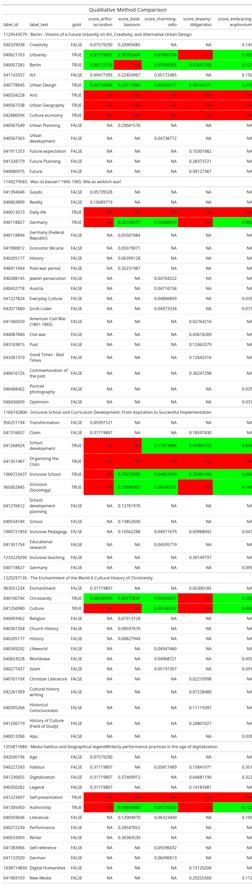

# Workbook 1:Inspecting Automatic Indexing Results Manually
Maximilian Kähler, DNB

- [Looking at Data-Formats](#looking-at-data-formats)
  - [Document Titles](#document-titles)
  - [Gold Standard Data](#gold-standard-data)
  - [Predictions](#predictions)
- [Creating a manual comparison
  table](#creating-a-manual-comparison-table)
- [Your Turn:](#your-turn)

In this preparation workbook we will start with looking at the data
formats that CASIMiR expects for computing retrieval metrics. Then, we
will create a manual comparison table that allows us to inspect
automatic subject suggestions in detail. This is very useful to get a
first qualitative impression of the strengths and weaknesses of
different automatic indexing methods.

## Looking at Data-Formats

Let’s start this tutorial by looking at the basic data formats and data
sets. The subfolder `data` contains the following datasets:

``` bash
tree ../data
```

``` bash
├── gnd_entitytypes.csv
├── gnd_pref-labels_w-translation.csv
├── README.md
├── subject-groups-labels.csv
├── test-set_doc-ids-and-titles_w-translation.csv
├── test-set_gold-standard.csv
├── test-set_predictions
│   ├── artful-accordion.csv
│   ├── bold-bassoon.csv
│   ├── charming-cello.csv
│   ├── dreamy-didgeridoo.csv
│   └── embracing-euphonium.csv
├── test-set_subject-group-mapping.csv
└── training-frequency-distribution.csv
```

Take a look at the file `data/REAMDE.md` for a description of all
datasets provided. Here we will only introduce the most important ones
for getting started.

### Document Titles

This tutorial is based on a test set of document titles provided by the
German National Library (DNB). The document titles are stored in the
file `data/test-set_doc-ids-and-titles_w-translation.csv`. English
translations are AI-generated and provided for convenience. Please
consider these translations with care.

``` r
doc_titles <- read_csv(
  "../data/test-set_doc-ids-and-titles_w-translation.csv"
)

num_docs <- nrow(doc_titles)

kable(
  head(doc_titles),
  caption = "Document IDs and Titles in the Test Set"
)
```

| doc_id | doc_title_ger | doc_title_eng |
|:---|:---|:---|
| 1122545479 | Prädiktive Fahrermodelle zur Simulation und Teilautomatisierung eines Hydraulikbaggers | Predictive driver models for simulating and partial automation of a hydraulic excavator |
| 1122561075 | Die Landesministerkonferenzen und der Bund kooperativer Föderalismus im Schatten der Politikverflechtung | The federal and state ministers’ conferences and the cooperative federalism in the shadow of political interdependence. |
| 1122562640 | Die Geburt der Philosophie im Garten der Lüste Michel Foucaults Archäologie des platonischen Eros | The Birth of Philosophy in the Garden of Pleasure: Michel Foucault’s Archeology of Platonic Eros |
| 1122587236 | Das Geldwäscherisiko verschiedener Glücksspielarten | The money laundering risk of various gambling types |
| 1122592507 | Entwicklung von großvolumigen CdTe- und (Cd,Zn)Te-Detektorsystemen | Development of high-volume CdTe and (Cd,Zn)Te detector systems |
| 1122593996 | Integrierte bioinformatische Methoden zur reproduzierbaren und transparenten Hochdurchsatz-Analyse von Life Science Big Data | Integrated bioinformatics methods for reproducible and transparent high-throughput analysis of life science big data |

Document IDs and Titles in the Test Set

The dataset contains 8415 document titles, their doc_id and
translations. Each `doc_id` can be resolved to the official public
record by prefixing the base-url `https://d-nb.info/`,
e.g. `doc_id = 1122545479` can be resolved to
<https://d-nb.info/1122545479>. Here you can access more metadata about
the document.

### Gold Standard Data

Each of the document titles was manually annotated by subject experts of
the DNB with subject terms from the Inegrated Authority File (GND).
Similar to the document identifiers, each GND subject term has a unique
identifier, the `label_id`, which can be resolved to the official GND
record by prefixing the base-url `https://d-nb.info/`,
e.g. `label_id = 041321634` can be resolved to
<https://d-nb.info/041321634>.

For more information on the GND please visit [the official GND
website](https://gnd.network/Webs/gnd/EN/Home/home_node.html). In
particular, you can find information on each subject term by visiting
the [GND explorer](https://explore.gnd.network/en/), where you can
search for each `label_id`.

``` r
gold_standard <- read_csv("../data/test-set_gold-standard.csv",
                          col_select = c("doc_id", "label_id"))

# load label_text
gnd_pref_labels <- read_csv("../data/gnd_pref-labels_w-translation.csv")
gold_standard_w_labels <- gold_standard |> 
  left_join(gnd_pref_labels, by = "label_id")

head(gold_standard_w_labels)
```

    # A tibble: 6 × 4
      doc_id     label_id  label_text_ger      label_text_eng     
      <chr>      <chr>     <chr>               <chr>              
    1 1122545479 041321634 Fahrzeugverhalten   Vehicle behavior   
    2 1122545479 041321650 Fahrerverhalten     Driver behavior    
    3 1122545479 041608607 Hydraulikbagger     Hydraulic excavator
    4 1122545479 042388120 Mechatronik         Mechatronics       
    5 1122545479 042718368 Prädiktive Regelung Predictive Control 
    6 1122545479 043049168 Systemmodell        System model       

For the rest of this tutorial This is our gold standard data that we
compare against.

### Predictions

The subfolder `data/test-set_predictions` contains machine based GND
subject suggestions coming from different methods.

``` bash
ls ../data/test-set_predictions
```

    artful-accordion.csv
    bold-bassoon.csv
    charming-cello.csv
    dreamy-didgeridoo.csv
    embracing-euphonium.csv

These datasets all follow the same long table format with columns
`doc_id`, `label_id` and `score`. Every row expresses a subject
assignment of some document with a label under a confidence score
computed by the respective indexing algorithm. The origin of each
prediction file is purposefully not disclosed here, to avoid any bias
when inspecting the results.

``` r
files <- list(
  "artful-accordion" = "../data/test-set_predictions/artful-accordion.csv",
  "bold-bassoon" = "../data/test-set_predictions/bold-bassoon.csv",
  "charming-cello" = "../data/test-set_predictions/charming-cello.csv",
  "dreamy-didgeridoo" = "../data/test-set_predictions/dreamy-didgeridoo.csv",
  "embracing-euphonium" = "../data/test-set_predictions/embracing-euphonium.csv"
)

# apply function read_csv to all files and store results in a named list
predictions <- files |> 
  map(read_csv) 

# show example predictions for one method  
head(predictions[["artful-accordion"]])
```

    # A tibble: 6 × 3
      doc_id     label_id    score
      <chr>      <chr>       <dbl>
    1 1122825404 043071929 0.182  
    2 1122825404 042124832 0.139  
    3 1122825404 970264100 0.0519 
    4 1123182132 043090133 0.387  
    5 1123118701 041290437 0.00257
    6 1123384193 041778928 0.195  

Gold standard and predictions are the basic input for computing any
retrieval scores.

## Creating a manual comparison table

Before we talk about metrics, let’s look at how we can beautifully join
all of the above tables and get a first informative impression of the
various subject suggestions originating from different automatic
indexing methods.

CASIMiR offers a basic method to construct a comparison table:

``` r
# join predictions with gold standard for one method
comp <- create_comparison(
  predicted = predictions[["artful-accordion"]],
  gold_standard = gold_standard
)
```

    Warning in create_comparison(predicted = predictions[["artful-accordion"]], :
    Gold standard data contains documents that are not in predicted set.

``` r
# display table for a specific document
comp  |>
  filter(doc_id == "1122545479")  |>
  select(-relevance)  |>
  kable()
```

| doc_id     | label_id  | gold  |     score | suggested |
|:-----------|:----------|:------|----------:|:----------|
| 1122545479 | 041321634 | TRUE  |        NA | FALSE     |
| 1122545479 | 041321650 | TRUE  |        NA | FALSE     |
| 1122545479 | 041608607 | TRUE  | 0.3171981 | TRUE      |
| 1122545479 | 042388120 | TRUE  |        NA | FALSE     |
| 1122545479 | 042718368 | TRUE  |        NA | FALSE     |
| 1122545479 | 043049168 | TRUE  |        NA | FALSE     |
| 1122545479 | 040550729 | FALSE | 0.7565188 | TRUE      |

Note, CASIMiR informs you that apparently not all documents were indexed
by “artful-accordion”. When working with larger data, that is quite
common: There are always edge cases with document titles that lead to
empty results. Silence, not SPAM, may also be a feature for an indexing
method…

Provided you don’t know DNB’s label and document ids by heart, you may
need more context in form of text descriptions. Below code wraps up a
lot of data wrangling to bring the tables into an instructive format:

``` r
# take a sample of 5 documents to inspect
set.seed(42)
sample_docs <- sample_n(doc_titles, size = 5)
# instead of random sampling, you can also specify specific doc_ids like this:
# sample_docs <- data.frame(
#   doc_id = c("1128159244", "1223180417", "1168229987")
# )

# modify `_eng` to `_ger` to see German original texts
qual_table <- create_qualitative_table(
  predicted = predictions,
  gold_standard = gold_standard,
  doc_id_list = select(sample_docs, doc_id),
  gnd = select(gnd_pref_labels, label_id, label_text = label_text_eng),
  title_texts = select(doc_titles, doc_id, title = doc_title_eng),
  limit = 5 # how many suggestions per method to consider?
)

qual_table
```


## Your Turn:

Inspect the above table:

- what subject suggestions do you agree with?

- are there false positives that would be okay, even if not contained in
  the gold standard?

- Which methods do you prefer?
