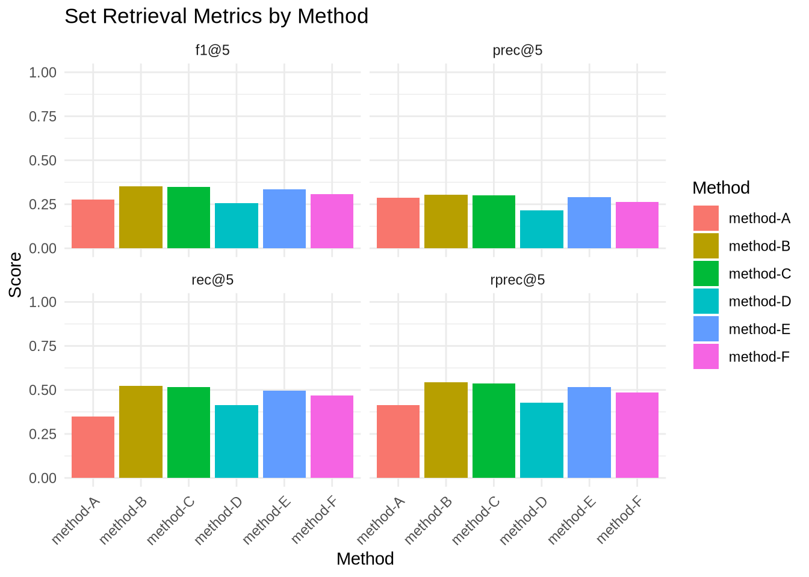

# Workbook 1: Set Retrieval Metrics
Maximilian Kähler, DNB

- [Computing overall set retrieval
  metrics](#computing-overall-set-retrieval-metrics)
- [Finding buttom and top performerming
  labels](#finding-buttom-and-top-performerming-labels)
- [Your Turn](#your-turn)
- [Bonus: A short digression to modes of
  aggregation](#bonus-a-short-digression-to-modes-of-aggregation)

In this workbook we will learn how to compute the basic set retrieval
metrics like precision, recall, and F1-score using the CASIMiR package.
We will also explore how to drill down into results on the subject level
to find the best and worst performing subject terms.

## Computing overall set retrieval metrics

The basic way to compute metrics with CASIMIiR is the function
`compute_set_retrieval_scores()`. It takes as input a set of predicted
labels and a gold standard set of labels and computes various retrieval
metrics such as precision, recall, and F1-score.

<div class="panel-tabset">

#### More about metrics

<details>

<summary>

Click to expand explanation of metrics
</summary>

Short reminder: **precision** is the fraction of suggested subject terms
that is correct, while **recall** is the fraction of gold standard
subject terms that are retrieved. Thus, while the denominator for recall
is based on the gold standard, the denominator for precision is based on
the number of predictions you choose to make.

**F1-score** is the harmonic mean of precision and recall.

**R-Precision** is the precision at $R$, where $R$ is the number of gold
standard subjects. This sort of avoids penalizing methods that suggest
way too many subjects, by limiting predictions to the actual amount of
relevant subjects that could be found.

</details>

</div>

The parameter `k` allows you to specify how many of the top predicted
labels should be considered for the computation of the metrics.

``` r
compute_set_retrieval_scores(
  predicted = predictions[["method-A"]],
  gold_standard = gold_standard,
  k = 5,
  rename_metrics = TRUE
)
```

    # A tibble: 4 × 4
      metric  mode    value support
      <chr>   <chr>   <dbl>   <dbl>
    1 f1@5    doc-avg 0.277    8415
    2 prec@5  doc-avg 0.289    8197
    3 rec@5   doc-avg 0.349    8415
    4 rprec@5 doc-avg 0.414    8197

The column `support` indicates how many documents have contributed to
the computation of the respective metric. If `method-A` made predictions
for all documents in the gold standard, this should be equal to the
number of documents in the gold standard. But if some documents were not
assigned any predicted labels, they are not considered for the
computation of precision. See below digression for more details on
aggregation modes and zero division handling.

You can iterate the function `compute_set_retrieval_scores()` over
multiple methods using the `map_*()` functions from the tidyverse
`purrr` package for functional data processing. `map_dfr()` is
particularly useful here as it combines the results into a single data
frame.

``` r
K <- 5

results <- map_dfr(
  predictions,
  ~ compute_set_retrieval_scores(
    predicted = .x,
    gold_standard = gold_standard,
    k = K,
    rename_metrics = TRUE
  ),
  # create id column from list names
  .id = "Method"
)

# bring results to wide tible for better display
results |> 
  select(-support) |> 
  pivot_wider(
    names_from = metric,
    values_from = value
  ) |>
kable(caption = paste0("Set retrieval metrics for all methods (k = ", K, ")"))
```

| Method   | mode    |      f1@5 |    prec@5 |     rec@5 |   rprec@5 |
|:---------|:--------|----------:|----------:|----------:|----------:|
| method-A | doc-avg | 0.2769323 | 0.2886015 | 0.3494472 | 0.4137266 |
| method-B | doc-avg | 0.3512206 | 0.3039176 | 0.5233464 | 0.5451911 |
| method-C | doc-avg | 0.3483506 | 0.3011289 | 0.5167074 | 0.5378927 |
| method-D | doc-avg | 0.2578584 | 0.2155991 | 0.4130448 | 0.4260111 |
| method-E | doc-avg | 0.3345450 | 0.2897207 | 0.4944938 | 0.5149772 |
| method-F | doc-avg | 0.3080582 | 0.2645752 | 0.4669618 | 0.4851891 |

Set retrieval metrics for all methods (k = 5)

Let’s make a first visualization using R\`s ggplot package

``` r
ggplot(results, aes(x = Method, y = value, fill = Method)) +
  geom_bar(stat = "identity") +
  ylim(0, 1) +
  facet_wrap(~ metric) +
  theme_minimal() +
  labs(
    title = "Set Retrieval Metrics by Method",
    x = "Method",
    y = "Score"
  ) + 
  theme(
    axis.text.x = element_text(angle = 45, hjust = 1)
  )
```



<details>

<summary>

Note
</summary>

Some people prefer to “zoom-in” on a smaller scale of the y-range to
emphasize the differences between methods. While this is sometimes
acceptable for visualization purposes, be aware that this can be
misleading as it visually exaggerates small differences. Always check
the actual values in the data table to get a true sense of the
performance differences.
</details>

## Finding buttom and top performerming labels

If you want to drill down into results on subject level, CASIMiR also
provides functions to disect results on the intermediate aggregation
level. The above function `compute_set_retrieval_scores()` is just a
convenient wrapper around three steps:

1.  `create_comparison()`: creates a detailed comparison of predicted
    vs.  gold standard labels for each doc_id, label_id pair.
2.  `compute_intermediate_results()`: computes true positives, false
    positives, and false negatives on the desired aggregation level (per
    document or per subject).
3.  `summarise_intermediate_results()` computes avarages of the
    intermediate results to yield the final precision, recall, and
    F1-score.

Let’s use this to find out the best and worst performing subject terms
for `method-A`.

``` r
label_texts <- read_csv("../data/gnd_pref-labels_w-translation.csv",
                        col_select = c("label_id", "label_text_eng"))

comp <- create_comparison(
  predicted = predictions[["method-A"]],
  gold_standard = gold_standard
)

intermed <- compute_intermediate_results(
  gold_vs_pred = comp,
  grouping_var = "label_id"
)$results_table |> 
  left_join(label_texts, by = "label_id")

intermed |>
  filter(n_gold > 20) |> 
  arrange(desc(f1)) |> 
  select(label_id, label_text_eng, tp, fp, fn, prec, rec, f1) |> 
  head(n = 10) |> 
  kable(
    caption = "Best performing subject terms for method-A with a mininimum of
     20 gold standard instances."
  )
```

| label_id  | label_text_eng             |  tp |  fp |  fn |      prec |       rec |        f1 |
|:----------|:---------------------------|----:|----:|----:|----------:|----------:|----------:|
| 118559796 | Kant, Immanuel (1724-1804) |  20 |   5 |   7 | 0.8000000 | 0.7407407 | 0.7692308 |
| 040402223 | Moral                      |  20 |  11 |   4 | 0.6451613 | 0.8333333 | 0.7272727 |
| 040464962 | Poland                     |  16 |   1 |  11 | 0.9411765 | 0.5925926 | 0.7272727 |
| 040598276 | Thermodynamics             |  15 |   3 |   9 | 0.8333333 | 0.6250000 | 0.7142857 |
| 04045956X | Physics                    |  44 |  31 |   7 | 0.5866667 | 0.8627451 | 0.6984127 |
| 040300463 | Cat                        |  19 |  16 |   2 | 0.5428571 | 0.9047619 | 0.6785714 |
| 040489469 | Reformation                |  13 |   5 |   9 | 0.7222222 | 0.5909091 | 0.6500000 |
| 040306380 | Childcare facility         |  13 |   6 |   9 | 0.6842105 | 0.5909091 | 0.6341463 |
| 974041238 | Resilience                 |  13 |   1 |  14 | 0.9285714 | 0.4814815 | 0.6341463 |
| 042979293 | Mindfulness                |  12 |   4 |  10 | 0.7500000 | 0.5454545 | 0.6315789 |

Best performing subject terms for method-A with a mininimum of 20 gold
standard instances.

``` r
intermed |>
  filter(n_gold > 20) |> 
  arrange(f1) |> 
  select(label_id, label_text_eng, tp, fp, fn, prec, rec, f1) |> 
  head(n = 10) |> 
  kable(
    caption = "Worst performing subject terms for method-A with a minimum of
     20 gold standard instances."
  )
```

| label_id | label_text_eng | tp | fp | fn | prec | rec | f1 |
|:---|:---|---:|---:|---:|---:|---:|---:|
| 040205487 | Gender Ratio | 0 | 1 | 25 | 0.0000000 | 0.0000000 | 0.0000000 |
| 040300056 | Catholic theology | 0 | 1 | 22 | 0.0000000 | 0.0000000 | 0.0000000 |
| 040665968 | Scientific manuscript | 0 | 0 | 34 | NA | 0.0000000 | 0.0000000 |
| 041849450 | Text production | 0 | 1 | 25 | 0.0000000 | 0.0000000 | 0.0000000 |
| 042090377 | Testing site | 0 | 4 | 27 | 0.0000000 | 0.0000000 | 0.0000000 |
| 949300403 | Python (Programming Language) | 0 | 0 | 21 | NA | 0.0000000 | 0.0000000 |
| 965002845 | Inclusion (Sociology) | 0 | 0 | 22 | NA | 0.0000000 | 0.0000000 |
| 041132920 | German | 4 | 180 | 23 | 0.0217391 | 0.1481481 | 0.0379147 |
| 040158330 | Protestant Church | 1 | 5 | 44 | 0.1666667 | 0.0222222 | 0.0392157 |
| 040124754 | Discourse | 2 | 14 | 32 | 0.1250000 | 0.0588235 | 0.0800000 |

Worst performing subject terms for method-A with a minimum of 20 gold
standard instances.

## Your Turn

Play around with the input options for `compute_set_retrieval_scores()`
(`?compute_set_retrieval_scores` is your friend)

- Observe how you can increase precision by lowering the `k` parameter,
  but at the cost of recall.
- What is the theoretical recall limit that you achieve by setting
  `k = 100` ?
- compare the top and bottom performing labels for other methods
- what happens when you switch aggregation modes `mode = "micro"` vs
  `mode = "doc-avg"` vs. `mode = "subj-avg"`? Can you explain the
  differences? (see below for more details)
- what are your preferred methods, so far?

## Bonus: A short digression to modes of aggregation

The `compute_set_retrieval_scores()` function supports three modes of
aggregation

- `mode = "doc-avg"`: (default) computes precision, recall, and F1-score
  for each **document** individually and then average these scores
  across all documents.
- `mode = "subj-avg"`: computes precision, recall, and F1-score for each
  **subject term** individually and then average these scores across all
  subject terms.
- `mode = "micro"`: computes global counts of true positives, false
  positives, and false negatives across all documents and subjects, and
  then calculates precision, recall, and F1-score based on these
  aggregated counts.

`subj-avg` and `doc-avg` are two flavours of so called macro-averaging,
where you first compute metrics on a more granular level (per document
or per subject) and then average them. This way, each document or
subject contributes equally to the final score, regardless of how many
predictions were made for each. In contrast, `micro` aggregation pools
all predictions together and computes overall counts. This way,
documents or subjects with more predictions have a larger impact on the
final score.

The column `support` indicates how many instances on the intermediate
level have contributed to the final score. For `doc_id` grouping, this
is the number of documents. For `label_id` grouping, this is the number
of subject terms. By default, CASIMiR ignores documents or subject terms
that have no predictions when computing precision macro averages. This
avoids zero-division issues. To be coherent with other packages like
[scikit-learn](https://scikit-learn.org/stable/modules/generated/sklearn.metrics.f1_score.html),
you can change this behaviour by using the argument
`replace_zero_division_with = 0` which will set precision to 0 for
documents or subject terms with no predictions, if they have occurences
in the gold standard.

Observe how much this can influence the overall value of precision and
recall in subject averaging mode:

``` r
compute_set_retrieval_scores(
  predicted = predictions[["method-A"]],
  gold_standard = gold_standard,
  k = 5,
  mode = "subj-avg",
  rename_metrics = TRUE,
  replace_zero_division_with = 0 # set to NA for default behaviour
)
```

    # A tibble: 4 × 4
      metric  mode     value support
      <chr>   <chr>    <dbl>   <dbl>
    1 f1@5    subj-avg 0.185   15808
    2 prec@5  subj-avg 0.209   15808
    3 rec@5   subj-avg 0.189   15808
    4 rprec@5 subj-avg 0.230   15808
