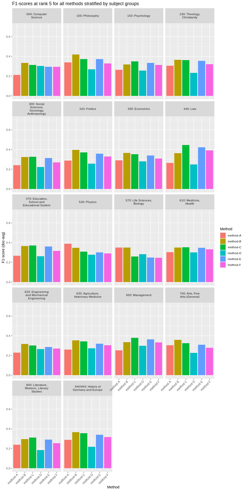

# Workbook 2: Stratified Set Retrieval Metrics
Maximilian Kähler, DNB

- [Stratified results by subject
  groups](#stratified-results-by-subject-groups)

We are now going to learn how to compute stratified set retrieval
metrics. This is an important technique to evaluate the performance of
subject indexing systems on different subsets of data, such as documents
belonging to different categories or subjects.

## Stratified results by subject groups

In the next code chunk we compute the set retrieval scores at rank 5 for
documents stratified by their subject groups using the
`compute_set_retrieval_scores()` function. This is as simple as the
`doc_groups` argument with a prepared data frame containing the document
IDs and their corresponding subject groups.

``` r
res_at_5_by_sg_method_A <- compute_set_retrieval_scores(
  predicted = predictions[["method-A"]],
  gold_standard = gold_standard,
  doc_groups = subject_groups,
  k = 5
)

head(res_at_5_by_sg_method_A)
```

    # A tibble: 6 × 7
      sg    sg_label_ger                     sg_label_eng metric mode  value support
      <chr> <chr>                            <chr>        <chr>  <chr> <dbl>   <dbl>
    1 004   Informatik                       Computer Sc… f1     doc-… 0.211     500
    2 100   Philosophie                      Philosophy   f1     doc-… 0.338     500
    3 150   Psychologie                      Psychology   f1     doc-… 0.264     500
    4 230   Theologie, Christentum           Theology, C… f1     doc-… 0.305     500
    5 300   Sozialwissenschaften, Soziologi… Social Scie… f1     doc-… 0.241     499
    6 320   Politik                          Politics     f1     doc-… 0.288     500

**Note on terminology**: We refer to “subject groups” here as groups of
documents that share a common subject classification, e.g. “History” or
“Science”. This is different from “subjects” in the sense of “subject
terms” or “subject headings”, which are the actual labels assigned to
documents.

As the information contained in the resulting data frame is quite
extensive, we apply some post-processing to simplify the display of
results. We filter for the metrics precision, recall, and F1-score,
remove unnecessary columns, and pivot the data frame to a wider format
for better readability.

``` r
# apply post processing to simplify display of results
res_at_5_by_sg_method_A  |>
  filter(metric %in% c("prec", "rec", "f1")) |> 
  select(-support, -mode)  |>
  pivot_wider(
    names_from = metric,
    values_from = value
  )  |>
  kable(caption = "Set retrieval scores at rank 5 for Method A stratified by subject groups.")
```

| sg | sg_label_ger | sg_label_eng | f1 | prec | rec |
|:---|:---|:---|---:|---:|---:|
| 004 | Informatik | Computer Science | 0.211 | 0.219 | 0.306 |
| 100 | Philosophie | Philosophy | 0.338 | 0.347 | 0.421 |
| 150 | Psychologie | Psychology | 0.264 | 0.264 | 0.340 |
| 230 | Theologie, Christentum | Theology, Christianity | 0.305 | 0.324 | 0.366 |
| 300 | Sozialwissenschaften, Soziologie, Anthropologie | Social Sciences, Sociology, Anthropology | 0.241 | 0.298 | 0.247 |
| 320 | Politik | Politics | 0.288 | 0.279 | 0.369 |
| 330 | Wirtschaft | Economics | 0.291 | 0.302 | 0.351 |
| 340 | Recht | Law | 0.263 | 0.313 | 0.276 |
| 370 | Erziehung, Schul- und Bildungswesen | Education, School and Educational System | 0.267 | 0.270 | 0.314 |
| 530 | Physik | Physics | 0.388 | 0.343 | 0.600 |
| 570 | Biowissenschaften, Biologie | Life Sciences, Biology | 0.349 | 0.327 | 0.476 |
| 610 | Medizin, Gesundheit | Medicine, Health | 0.303 | 0.323 | 0.379 |
| 620 | Ingenieurwissenschaften und Maschinenbau | Engineering and Mechanical Engineering | 0.229 | 0.304 | 0.264 |
| 630 | Landwirtschaft, Veterinärmedizin | Agriculture, Veterinary Medicine | 0.259 | 0.238 | 0.367 |
| 650 | Management | Management | 0.252 | 0.248 | 0.333 |
| 700 | Künste, Bildende Kunst allgemein | Arts, Fine Arts (General) | 0.303 | 0.334 | 0.351 |
| 800 | Literatur, Rhetorik, Literaturwissenschaft | Literature, Rhetoric, Literary Studies | 0.239 | 0.243 | 0.299 |
| 940 | Geschichte Europas | History of Europe | 0.272 | 0.260 | 0.392 |
| 943 | Geschichte Deutschlands | History of Germany | 0.307 | 0.280 | 0.462 |

Set retrieval scores at rank 5 for Method A stratified by subject
groups.

We can see that the performance of Method A varies across different
subject groups. For example, the f1-score for physics is best, whereas
computer science has the lowest f1-score.

While this sort of analysis can be done manually for each method, it is
often more convenient to compute the stratified results for all methods
in one go.

``` r
res_at_5_by_sg_all_methods <- map_dfr(
  predictions,
  ~ compute_set_retrieval_scores(
    predicted = .x,
    gold_standard = gold_standard,
    doc_groups = subject_groups,
    k = 5),
  .id = "Method"
)

head(res_at_5_by_sg_all_methods)
```

    # A tibble: 6 × 8
      Method   sg    sg_label_ger            sg_label_eng metric mode  value support
      <chr>    <chr> <chr>                   <chr>        <chr>  <chr> <dbl>   <dbl>
    1 method-A 004   Informatik              Computer Sc… f1     doc-… 0.211     500
    2 method-A 100   Philosophie             Philosophy   f1     doc-… 0.338     500
    3 method-A 150   Psychologie             Psychology   f1     doc-… 0.264     500
    4 method-A 230   Theologie, Christentum  Theology, C… f1     doc-… 0.305     500
    5 method-A 300   Sozialwissenschaften, … Social Scie… f1     doc-… 0.241     499
    6 method-A 320   Politik                 Politics     f1     doc-… 0.288     500

As above, we apply some post-processing to simplify the display of
results.

``` r
# apply post processing to simplify display of results
res_at_5_by_sg_all_methods  |>
  filter(metric == "f1") |>
  select(-support, -mode)  |>
  pivot_wider(
    names_from = Method,
    values_from = value
  )  |>
  kable(caption = "F1-scores at rank 5 for all methods stratified by subject groups.")
```

| sg | sg_label_ger | sg_label_eng | metric | method-A | method-B | method-C | method-D | method-E | method-F |
|:---|:---|:---|:---|---:|---:|---:|---:|---:|---:|
| 004 | Informatik | Computer Science | f1 | 0.211 | 0.333 | 0.312 | 0.303 | 0.295 | 0.294 |
| 100 | Philosophie | Philosophy | f1 | 0.338 | 0.420 | 0.373 | 0.269 | 0.372 | 0.328 |
| 150 | Psychologie | Psychology | f1 | 0.264 | 0.320 | 0.350 | 0.257 | 0.335 | 0.312 |
| 230 | Theologie, Christentum | Theology, Christianity | f1 | 0.305 | 0.365 | 0.363 | 0.232 | 0.356 | 0.322 |
| 300 | Sozialwissenschaften, Soziologie, Anthropologie | Social Sciences, Sociology, Anthropology | f1 | 0.241 | 0.324 | 0.327 | 0.222 | 0.313 | 0.269 |
| 320 | Politik | Politics | f1 | 0.288 | 0.396 | 0.371 | 0.257 | 0.358 | 0.329 |
| 330 | Wirtschaft | Economics | f1 | 0.291 | 0.365 | 0.352 | 0.281 | 0.339 | 0.307 |
| 340 | Recht | Law | f1 | 0.263 | 0.362 | 0.445 | 0.250 | 0.422 | 0.392 |
| 370 | Erziehung, Schul- und Bildungswesen | Education, School and Educational System | f1 | 0.267 | 0.365 | 0.370 | 0.262 | 0.360 | 0.316 |
| 530 | Physik | Physics | f1 | 0.388 | 0.349 | 0.308 | 0.279 | 0.300 | 0.291 |
| 570 | Biowissenschaften, Biologie | Life Sciences, Biology | f1 | 0.349 | 0.350 | 0.259 | 0.282 | 0.250 | 0.247 |
| 610 | Medizin, Gesundheit | Medicine, Health | f1 | 0.303 | 0.350 | 0.352 | 0.301 | 0.348 | 0.332 |
| 620 | Ingenieurwissenschaften und Maschinenbau | Engineering and Mechanical Engineering | f1 | 0.229 | 0.316 | 0.300 | 0.266 | 0.285 | 0.270 |
| 630 | Landwirtschaft, Veterinärmedizin | Agriculture, Veterinary Medicine | f1 | 0.259 | 0.352 | 0.344 | 0.273 | 0.320 | 0.305 |
| 650 | Management | Management | f1 | 0.252 | 0.335 | 0.378 | 0.298 | 0.363 | 0.334 |
| 700 | Künste, Bildende Kunst allgemein | Arts, Fine Arts (General) | f1 | 0.303 | 0.357 | 0.324 | 0.226 | 0.309 | 0.277 |
| 800 | Literatur, Rhetorik, Literaturwissenschaft | Literature, Rhetoric, Literary Studies | f1 | 0.239 | 0.297 | 0.312 | 0.185 | 0.290 | 0.255 |
| 940 | Geschichte Europas | History of Europe | f1 | 0.272 | 0.357 | 0.356 | 0.206 | 0.333 | 0.301 |
| 943 | Geschichte Deutschlands | History of Germany | f1 | 0.307 | 0.375 | 0.356 | 0.235 | 0.346 | 0.335 |

F1-scores at rank 5 for all methods stratified by subject groups.

Here we have reached a level of detail, where displaying only numbers
makes it quite challenging to interpret the results. Visualizations can
help to better understand the performance of different methods across
subject groups.

``` r
res_at_5_by_sg_all_methods  |>
  filter(metric == "f1") |>
  ggplot(aes(x = Method, y = value, fill = Method)) +
  ylim(0, 0.7) +
  geom_bar(stat = "identity", position = "dodge") +
  facet_wrap(
    ~sg_label_eng,
    ncol = 4,
    labeller = label_wrap_gen(width = 20)
  ) +
  labs(
    title = "F1-scores at rank 5 for all methods stratified by subject groups",
    x = "Method",
    y = "F1-score"
  ) + 
  theme(
    axis.text.x = element_text(angle = 45, hjust = 1)
  )
```


