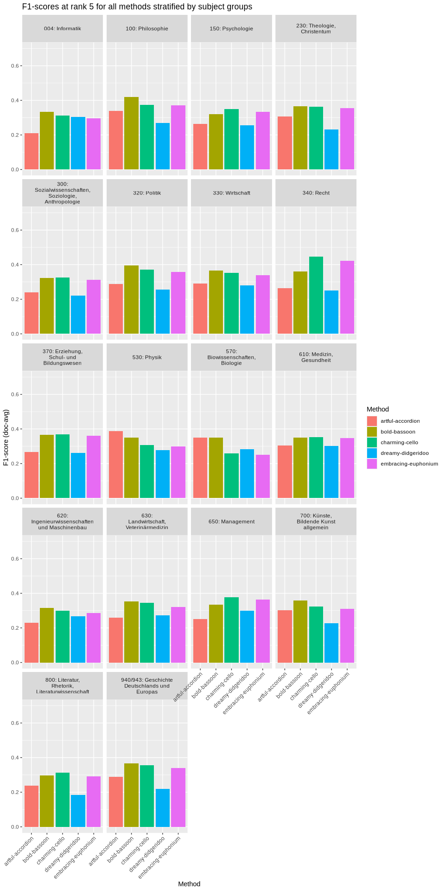
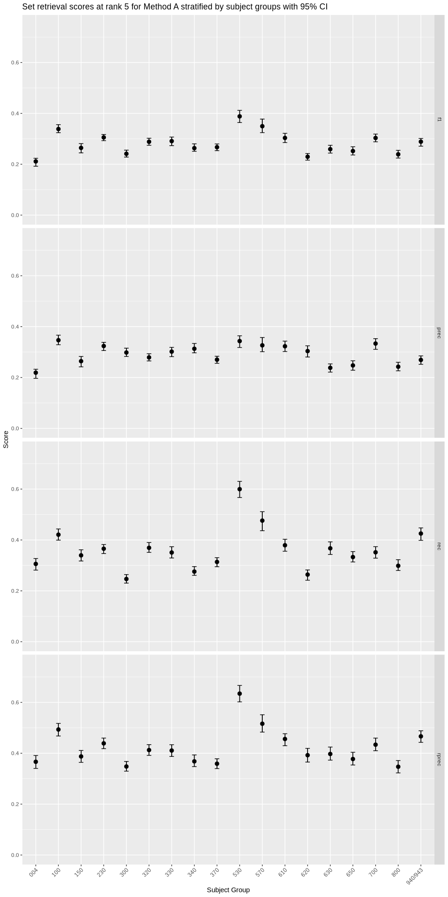
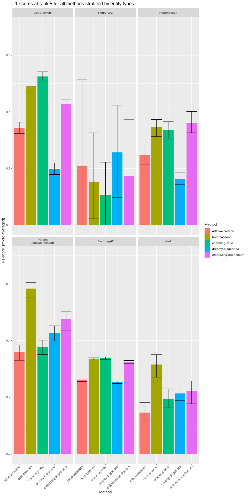

# Workbook 3: Stratified Set Retrieval Metrics
Maximilian Kähler, DNB

- [Stratified results by document
  groups](#stratified-results-by-document-groups)
- [Your turn](#your-turn)
- [Bonus: Confidence Intervals](#bonus-confidence-intervals)
- [Bonus: Stratify by entity types of the
  vocabulary](#bonus-stratify-by-entity-types-of-the-vocabulary)

We are now going to learn how to compute stratified set retrieval
metrics. This is an important technique to evaluate the performance of
subject indexing systems on different subsets of data, such as documents
belonging to different categories or subjects.

## Stratified results by document groups

In the next code chunk we compute the set retrieval scores at rank 5 for
documents stratified by their subject groups using the
`compute_set_retrieval_scores()` function. This is as simple as using
the `doc_groups` argument with a prepared data frame containing the
document IDs and their corresponding subject groups.

``` r
res_at_5_by_sg_artful_accordion <- compute_set_retrieval_scores(
  predicted = predictions[["artful-accordion"]],
  gold_standard = gold_standard,
  doc_groups = subject_groups,
  k = 5
)

head(res_at_5_by_sg_artful_accordion)
```

    # A tibble: 6 × 7
      sg    sg_label_ger                     sg_label_eng metric mode  value support
      <fct> <fct>                            <fct>        <chr>  <chr> <dbl>   <dbl>
    1 004   Informatik                       Computer Sc… f1     doc-… 0.211     500
    2 100   Philosophie                      Philosophy   f1     doc-… 0.338     500
    3 150   Psychologie                      Psychology   f1     doc-… 0.264     500
    4 230   Theologie, Christentum           Theology, C… f1     doc-… 0.305     500
    5 300   Sozialwissenschaften, Soziologi… Social Scie… f1     doc-… 0.241     499
    6 320   Politik                          Politics     f1     doc-… 0.288     500

**Note on terminology**: We refer to “subject groups” here as groups of
documents that share a common subject classification, e.g. “History” or
“Science”. This is different from “subjects” in the sense of “subject
terms” or “subject headings”, which are the actual labels assigned to
documents in the process of subject indexing.

As the information contained in the resulting data frame is quite
extensive, we apply some post-processing to simplify the display of
results. We filter for the metrics precision, recall, and F1-score,
remove unnecessary columns, and pivot the data frame to a wider format
for better readability.

``` r
# apply post processing to simplify display of results
res_at_5_by_sg_artful_accordion  |>
  filter(metric %in% c("prec", "rec", "f1")) |> 
  select(-support, -mode)  |>
  pivot_wider(
    names_from = metric,
    values_from = value
  )  |>
  kable(caption = "Set retrieval scores at rank 5 for artful-accordion stratified by subject group.")
```

| sg | sg_label_ger | sg_label_eng | f1 | prec | rec |
|:---|:---|:---|---:|---:|---:|
| 004 | Informatik | Computer Science | 0.211 | 0.219 | 0.306 |
| 100 | Philosophie | Philosophy | 0.338 | 0.347 | 0.421 |
| 150 | Psychologie | Psychology | 0.264 | 0.264 | 0.340 |
| 230 | Theologie, Christentum | Theology, Christianity | 0.305 | 0.324 | 0.366 |
| 300 | Sozialwissenschaften, Soziologie, Anthropologie | Social Sciences, Sociology, Anthropology | 0.241 | 0.298 | 0.247 |
| 320 | Politik | Politics | 0.288 | 0.279 | 0.369 |
| 330 | Wirtschaft | Economics | 0.291 | 0.302 | 0.351 |
| 340 | Recht | Law | 0.263 | 0.313 | 0.276 |
| 370 | Erziehung, Schul- und Bildungswesen | Education, School and Educational System | 0.267 | 0.270 | 0.314 |
| 530 | Physik | Physics | 0.388 | 0.343 | 0.600 |
| 570 | Biowissenschaften, Biologie | Life Sciences, Biology | 0.349 | 0.327 | 0.476 |
| 610 | Medizin, Gesundheit | Medicine, Health | 0.303 | 0.323 | 0.379 |
| 620 | Ingenieurwissenschaften und Maschinenbau | Engineering and Mechanical Engineering | 0.229 | 0.304 | 0.264 |
| 630 | Landwirtschaft, Veterinärmedizin | Agriculture, Veterinary Medicine | 0.259 | 0.238 | 0.367 |
| 650 | Management | Management | 0.252 | 0.248 | 0.333 |
| 700 | Künste, Bildende Kunst allgemein | Arts, Fine Arts (General) | 0.303 | 0.334 | 0.351 |
| 800 | Literatur, Rhetorik, Literaturwissenschaft | Literature, Rhetoric, Literary Studies | 0.239 | 0.243 | 0.299 |
| 940/943 | Geschichte Deutschlands und Europas | History of Germany and Europe | 0.289 | 0.269 | 0.425 |

Set retrieval scores at rank 5 for artful-accordion stratified by
subject group.

We can see that the performance of artful-accordion varies across
different subject groups. For example, the f1-score for physics is best,
whereas computer science has the lowest f1-score.

While this sort of analysis can be done manually for each method, it is
often more convenient to compute the stratified results for all methods
in one go.

``` r
# iterate over all methods and compute set retrieval scores by subject groups
res_at_5_by_sg_all_methods <- map_dfr(
  predictions,
  ~ compute_set_retrieval_scores(
    predicted = .x,
    gold_standard = gold_standard,
    doc_groups = subject_groups,
    k = 5),
  .id = "Method"
)

head(res_at_5_by_sg_all_methods)
```

    # A tibble: 6 × 8
      Method           sg    sg_label_ger    sg_label_eng metric mode  value support
      <chr>            <fct> <fct>           <fct>        <chr>  <chr> <dbl>   <dbl>
    1 artful-accordion 004   Informatik      Computer Sc… f1     doc-… 0.211     500
    2 artful-accordion 100   Philosophie     Philosophy   f1     doc-… 0.338     500
    3 artful-accordion 150   Psychologie     Psychology   f1     doc-… 0.264     500
    4 artful-accordion 230   Theologie, Chr… Theology, C… f1     doc-… 0.305     500
    5 artful-accordion 300   Sozialwissensc… Social Scie… f1     doc-… 0.241     499
    6 artful-accordion 320   Politik         Politics     f1     doc-… 0.288     500

As above, we apply some post-processing to simplify the display of
results.

``` r
# apply post processing to simplify display of results
res_at_5_by_sg_all_methods  |>
  filter(metric == "f1") |>
  select(-support, -mode)  |>
  pivot_wider(
    names_from = Method,
    values_from = value
  )  |>
  kable(caption = "F1-scores at rank 5 for all methods stratified by subject groups.")
```

| sg | sg_label_ger | sg_label_eng | metric | artful-accordion | bold-bassoon | charming-cello | dreamy-didgeridoo | embracing-euphonium |
|:---|:---|:---|:---|---:|---:|---:|---:|---:|
| 004 | Informatik | Computer Science | f1 | 0.211 | 0.333 | 0.312 | 0.303 | 0.295 |
| 100 | Philosophie | Philosophy | f1 | 0.338 | 0.420 | 0.373 | 0.269 | 0.372 |
| 150 | Psychologie | Psychology | f1 | 0.264 | 0.320 | 0.350 | 0.257 | 0.335 |
| 230 | Theologie, Christentum | Theology, Christianity | f1 | 0.305 | 0.365 | 0.363 | 0.232 | 0.356 |
| 300 | Sozialwissenschaften, Soziologie, Anthropologie | Social Sciences, Sociology, Anthropology | f1 | 0.241 | 0.324 | 0.327 | 0.222 | 0.313 |
| 320 | Politik | Politics | f1 | 0.288 | 0.396 | 0.371 | 0.257 | 0.358 |
| 330 | Wirtschaft | Economics | f1 | 0.291 | 0.365 | 0.352 | 0.281 | 0.339 |
| 340 | Recht | Law | f1 | 0.263 | 0.362 | 0.445 | 0.250 | 0.422 |
| 370 | Erziehung, Schul- und Bildungswesen | Education, School and Educational System | f1 | 0.267 | 0.365 | 0.370 | 0.262 | 0.360 |
| 530 | Physik | Physics | f1 | 0.388 | 0.349 | 0.308 | 0.279 | 0.300 |
| 570 | Biowissenschaften, Biologie | Life Sciences, Biology | f1 | 0.349 | 0.350 | 0.259 | 0.282 | 0.250 |
| 610 | Medizin, Gesundheit | Medicine, Health | f1 | 0.303 | 0.350 | 0.352 | 0.301 | 0.348 |
| 620 | Ingenieurwissenschaften und Maschinenbau | Engineering and Mechanical Engineering | f1 | 0.229 | 0.316 | 0.300 | 0.266 | 0.285 |
| 630 | Landwirtschaft, Veterinärmedizin | Agriculture, Veterinary Medicine | f1 | 0.259 | 0.352 | 0.344 | 0.273 | 0.320 |
| 650 | Management | Management | f1 | 0.252 | 0.335 | 0.378 | 0.298 | 0.363 |
| 700 | Künste, Bildende Kunst allgemein | Arts, Fine Arts (General) | f1 | 0.303 | 0.357 | 0.324 | 0.226 | 0.309 |
| 800 | Literatur, Rhetorik, Literaturwissenschaft | Literature, Rhetoric, Literary Studies | f1 | 0.239 | 0.297 | 0.312 | 0.185 | 0.290 |
| 940/943 | Geschichte Deutschlands und Europas | History of Germany and Europe | f1 | 0.289 | 0.366 | 0.356 | 0.219 | 0.340 |

F1-scores at rank 5 for all methods stratified by subject groups.

Here we have reached a level of detail, where displaying only numbers
makes it quite challenging to interpret the results. Visualizations can
help to better understand the performance of different methods across
subject groups.

``` r
res_at_5_by_sg_all_methods  |>
  filter(metric == "f1") |>
  ggplot(aes(x = Method, y = value, fill = Method)) +
  ylim(0, 0.7) +
  geom_bar(stat = "identity", position = "dodge") +
  facet_wrap(
    vars(paste0(sg, ": ", sg_label_ger)),
    ncol = 4,
    labeller = label_wrap_gen(width = 20)
  ) +
  labs(
    title = "F1-scores at rank 5 for all methods stratified by subject groups",
    x = "Method",
    y = "F1-score (doc-avg)"
  ) + 
  theme(
    axis.text.x = element_text(angle = 45, hjust = 1)
  )
```



## Your turn

Some questions that may help to reflect on the results:

- which methods would win in the respective subject groups?
- are there subject groups with similar performance characteristics
  across methods?
- are there subject groups that show very distinct performance
  characteristics from the other groups?
- alter the above plot to show precision or recall instead of f1-score.
  Do you observe different trends?

## Bonus: Confidence Intervals

The smaller we make the strata in our analysis, the larger will be the
uncertainty of performance estimates in these strata. We should not jump
to conclusions based on results that are statistically unsound. This is
why it is important to take into account uncertainty by computing
confidence intervals. Using the option `compute_bootstrap_ci = TRUE`
will compute 95% confidence intervals for each score. These are based on
the [bootstrap
method](https://stat20.berkeley.edu/fall-2024/3-generalization/09-bootstrapping/notes.html).
Bootstrapping is a resampling technique that involves repeatedly
sampling with replacement from the original data to create “bootstrap
samples”. The metrics of interest (e.g., f1, precision, recall) are
calculated for each bootstrap sample, resulting in a distribution of the
metric. This distribution can then be used to estimate confidence
intervals. The parameter `n_bt` specifies the number of bootstrap
samples to generate. The more samples, the more reliable the confidence
intervals, but also the longer the computation time. When computing
confidence intervals, it is often beneficial to use parallel processing
to speed up the computation. This can be done using the
[future](https://future.futureverse.org/) package.

``` r
# optionally use parallel processing for faster computation
library(future)
plan(multicore)

res_at_5_by_sg_artful_accordion_ci <- compute_set_retrieval_scores(
  predicted = predictions[["artful-accordion"]],
  gold_standard = gold_standard,
  doc_groups = subject_groups,
  k = 5,
  compute_bootstrap_ci = TRUE,
  n_bt = 100L, # number of bootstrap samples for confidence intervals
  progress = TRUE
)

head(res_at_5_by_sg_artful_accordion_ci)
```

    # A tibble: 6 × 9
      sg    sg_label_ger   sg_label_eng metric mode  value ci_lower ci_upper support
      <fct> <fct>          <fct>        <chr>  <chr> <dbl>    <dbl>    <dbl>   <dbl>
    1 004   Informatik     Computer Sc… f1     doc-… 0.211    0.192    0.224     500
    2 100   Philosophie    Philosophy   f1     doc-… 0.338    0.324    0.356     500
    3 150   Psychologie    Psychology   f1     doc-… 0.264    0.245    0.281     500
    4 230   Theologie, Ch… Theology, C… f1     doc-… 0.305    0.293    0.317     500
    5 300   Sozialwissens… Social Scie… f1     doc-… 0.241    0.228    0.255     499
    6 320   Politik        Politics     f1     doc-… 0.288    0.274    0.302     500

``` r
plan(sequential) # reset to sequential processing
```

The resulting data frame now contains additional columns for the lower
and upper bounds of the confidence intervals (`ci_lower` and
`ci_upper`). These can be used to visualize the uncertainty of the
estimates in a plot:

``` r
# plot results with confidence intervals
ggplot(
  res_at_5_by_sg_artful_accordion_ci,
  aes(x = sg, y = value, ymin = ci_lower, ymax = ci_upper)
) + 
  geom_pointrange(position = position_dodge(width = 0.5)) +
  geom_errorbar(width = 0.2, position = position_dodge(width = 0.5)) +
  ylim(0, 0.75) +
  labs(
    title = "Set retrieval scores at rank 5 for Method A stratified by subject groups with 95% CI",
    x = "Subject Group",
    y = "Score"
  ) +
  facet_grid(rows = vars(metric)) +
  theme(
    axis.text.x = element_text(angle = 45, hjust = 1)
  )
```



**Note:** You can also modify the previous bar-chart to include
confidence intervals by using the same approach as shown. Add the
`compute_bootstrap_ci = TRUE` and `n_bt` parameters to the
`compute_set_retrieval_scores()` function calls and then add the
following lines to the ggplot code:

``` r
geom_errorbar(
  mapping = aes(ymin = ci_lower, ymax = ci_upper),
  stat = "identity", 
  position = "dodge") +
```

## Bonus: Stratify by entity types of the vocabulary

In the above examples we stratified the results by document groups. It
is also possible to stratify by label groups, e.g. by entity types of
the vocabulary. `CASIMiR` makes this easy by allowing to pass a data
frame with label IDs and their corresponding groups to the
`label_groups` argument of the `compute_set_retrieval_scores()`
function.

``` r
# optionally use parallel processing for faster computation
library(future)
plan(multicore)

res_at_5_by_entity_type_all_methods <- map_dfr(
  predictions,
  ~ compute_set_retrieval_scores(
    predicted = .x,
    gold_standard = gold_standard,
    label_groups = gnd_entity_types, # stratify by label entity types
    mode = "micro", # use micro-averaging for label_groups
    compute_bootstrap_ci = TRUE,
    n_bt = 100L,
    k = 5,
    progress = TRUE),
  .id = "Method"
)

plan(sequential) # reset to sequential processing

head(res_at_5_by_entity_type_all_methods)
```

    # A tibble: 6 × 9
      Method   label_entitytype_ger label_entitytype_eng metric mode  value ci_lower
      <chr>    <chr>                <chr>                <chr>  <chr> <dbl>    <dbl>
    1 artful-… Geografikum          geographic name      f1     micro 0.343   0.324 
    2 artful-… Konferenz            conference           f1     micro 0.211   0     
    3 artful-… Körperschaft         corporation          f1     micro 0.247   0.215 
    4 artful-… NA                   NA                   f1     micro 0.25    0.0345
    5 artful-… Person (individuali… person (individuali… f1     micro 0.359   0.330 
    6 artful-… Sachbegriff          subject term         f1     micro 0.259   0.255 
    # ℹ 2 more variables: ci_upper <dbl>, support <dbl>

**Note:** Here we set the `mode` parameter to `"micro"` to compute
micro-averaged scores across all documents for each entity type. This is
often more meaningful when stratifying by label groups, as some entity
types may have very few associated labels.

``` r
res_at_5_by_entity_type_all_methods  |>
  filter(metric == "f1", label_entitytype_ger != "NA") |>
  ggplot(aes(x = Method, y = value, fill = Method)) +
  ylim(0, 0.7) +
  geom_bar(stat = "identity", position = "dodge") +
  geom_errorbar(
    mapping = aes(ymin = ci_lower, ymax = ci_upper),
    stat = "identity", 
    position = "dodge"
  ) +
  facet_wrap(
    vars(label_entitytype_ger),
    ncol = 3,
    labeller = label_wrap_gen(width = 20)
  ) +
  labs(
    title = "F1-scores at rank 5 for all methods stratified by entity types",
    x = "Method",
    y = "F1-score  (micro averaged)"
  ) + 
  theme(
    axis.text.x = element_text(angle = 45, hjust = 1)
  )
```



Observe how the confidence intervals show extreme ranges for entity
types with very few observed labels (e.g. conferences), and very narrow
ranges for entity types with many labels, e.g. subject terms.
