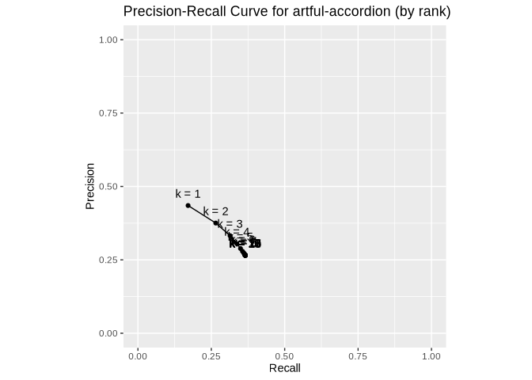
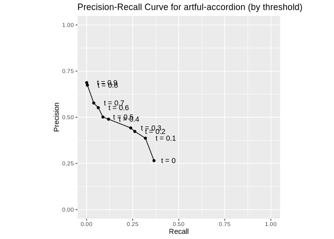
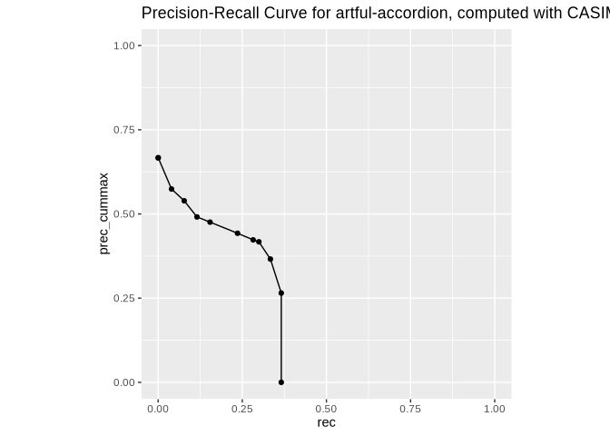
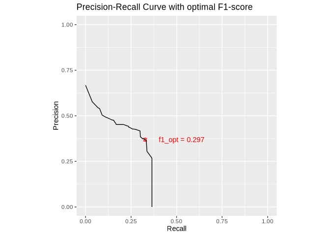
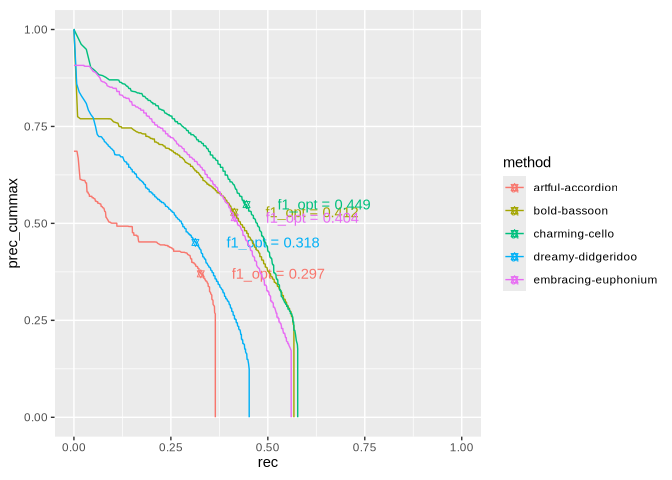
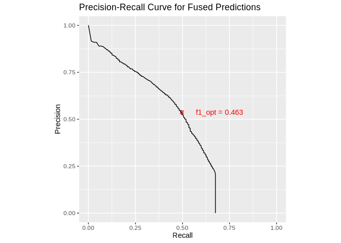

# Workbook 4: Precision Recall Curves
Maximilian Kähler, DNB

- [The idea of precision-recall
  curves](#the-idea-of-precision-recall-curves)
- [Precision-recall curves with
  CASIMiR](#precision-recall-curves-with-casimir)
- [Area under the precision recall curve
  (pr-AUC)](#area-under-the-precision-recall-curve-pr-auc)
  - [Finding optimal cutoffs](#finding-optimal-cutoffs)
- [Comparing PR-Curves of multiple
  methods](#comparing-pr-curves-of-multiple-methods)
- [Your turn](#your-turn)
- [Bonus exercise: Fusing
  predictions](#bonus-exercise-fusing-predictions)

**Note:** If you run out of time, you can also skip this workbook and go
directly to the workbook 5 on long-tail analysis.

So far we have studied set retrieval metrics: metrics that assume a
fixed set of predictions. In most exercises we have already used that,
in practice, many indexing methods produce ranked lists of candidates.
We previously applied a limit `k = 5`, telling CASIMiR to only look at
the top-5 predictions per document. These ranks are based on
**confidence scores** for each suggested subject candidate. Instead of
cutting off at a fixed rank `k`, we can also cut off at a fixed
confidence score threshold. This provides another way to vary the
trade-off between **precision** (how many of the suggested subjects are
correct) and **recall** (how many of the correct subjects are
suggested). In this exercise, we will compute precision-recall curves,
visualizing this trade-off for different for different methods.

## The idea of precision-recall curves

To get to know precision-recall curves, let’s first do all the
computations step-by-step, before we later use CASIMiR’s built-in
functions to compute precision-recall curves directly.

Let’s define a function that computes precision and recall for method
`artful-accordion` at **varying limits** `k`:

``` r
# compute precision and recall at k for method artful-accordion
prec_rec_rank <- function(k) {
  res_at_k <- compute_set_retrieval_scores(
    predicted = predictions[["artful-accordion"]],
    gold_standard = gold_standard,
    k = k
  )  

  # simplify output to only precision and recall
  res <- res_at_k  |>
    filter(metric %in% c("prec", "rec"))  |>
    select(metric, value)  |>
    pivot_wider(names_from = metric, values_from = value)  |>
    select(prec, rec)  |>
    mutate(k = k)

  res
}

prec_rec_rank(5)
```

    # A tibble: 1 × 3
       prec   rec     k
      <dbl> <dbl> <dbl>
    1 0.289 0.349     5

Now we can compute precision and recall for all limits `k` from 1 to 20
and plot the results:

``` r
# define a range of limits to compute precision and recall for
k_range <- 1:20
# apply function to all limits and combine results into a data frame
prec_rec_rank_df <- map_dfr(k_range, prec_rec_rank)
# visualize point estimates as precision-recall curve
ggplot(prec_rec_rank_df, aes(x = rec, y = prec)) +
  geom_path() +
  geom_point() +
  geom_text(aes(label = paste0("k = ", k)), vjust = -1) +
  coord_fixed(xlim = c(0, 1), ylim = c(0, 1)) +
  labs(
    title = "Precision-Recall Curve for artful-accordion (by rank)",
    x = "Recall",
    y = "Precision"
  )
```



The same idea can be applied not to the **rank** but to the **confidence
score**. Let’s define a function that computes precision and recall for
method `artful-accordion` at **varying confidence score thresholds**:

``` r
# compute precision and recall at a given threshold for method artful-accordion
prec_rec_threshold <- function(threshold) {
  # filter predictions by threshold
  predictions_thresholded <- predictions[["artful-accordion"]] |>
    filter(score >= threshold)
  
  # compute precision and recall at threshold
  res_at_threshold <- compute_set_retrieval_scores(
    predicted = predictions_thresholded,
    gold_standard = gold_standard,
  )  

  # simplify output to only precision and recall
  res <- res_at_threshold  |>
    filter(metric %in% c("prec", "rec"))  |>
    select(metric, value)  |>
    pivot_wider(names_from = metric, values_from = value)  |>
    select(prec, rec)  |>
    mutate(threshold = threshold)

  res
}
# show example computation for threshold 0.1
prec_rec_threshold(0.1)
```

    # A tibble: 1 × 3
       prec   rec threshold
      <dbl> <dbl>     <dbl>
    1 0.387 0.319       0.1

Again, we can compute precision and recall for a range of thresholds
from 0 to 1 and plot the results:

``` r
# .define a range of thresholds to compute precision and recall for
threshold_range <- seq(0, 1, by = 0.1)
# apply function to all thresholds and combine results into a data frame
prec_rec_threshold_df <- map_dfr(threshold_range, prec_rec_threshold)
# visualize point estimates as precision-recall curve
ggplot(prec_rec_threshold_df, aes(x = rec, y = prec)) +
  geom_path() +
  geom_point() +
  geom_text(aes(label = paste0("t = ", round(threshold, 2))), hjust = -0.5) +
  coord_fixed(xlim = c(0, 1), ylim = c(0, 1)) + 
  labs(
    title = "Precision-Recall Curve for artful-accordion (by threshold)",
    x = "Recall",
    y = "Precision"
  )
```



If you increase the number of steps,
e.g. `threshold_range <- seq(0, 1, by = 0.05)`, you may note some
“wiggeling” (non-monotonicity) of the pr-curve. Increasing the threshold
does not always lead to an increase in precision. In this case one
would, in practice, use the lower threshold that achieves higher recall
with higher precision. This is why usually precision-recall curves do
not plot the precision but the **cumulative maximum precision**
(`prec_cummax`), which is guaranteed to be non-increasing with
increasing recall. `prec_cummax` at recall level `r` is defined as the
maximum precision achieved at any recall `r' >= r`.

## Precision-recall curves with CASIMiR

It is tedious and error-prone to compute precision-recall curves
step-by-step as we did above. CASIMiR provides a convenient function to
compute precision-recall curves directly:

``` r
# compute precision-recall curve for one method using CASIMiR
pr_curve <- compute_pr_curve(
  predicted = predictions[["artful-accordion"]],
  gold_standard = gold_standard,
  steps = 10
)
# visualize pr-curve
ggplot(pr_curve$plot_data, aes(x = rec, y = prec_cummax)) +
  geom_point() +
  geom_path() +
  coord_fixed(xlim = c(0, 1), ylim = c(0, 1)) + 
  ggtitle("Precision-Recall Curve for artful-accordion, computed with CASIMiR")
```



By default, CASIMiR computes the pr-curve using thresholding over
confidence scores. The threshold range is controlled by the `steps`
argument, which defaults to 100. Here we work with a lower number of
steps for faster computation. You can also include a search over ranks
by adding the argument `limit_range = 1:5` or similar. This will compute
precision and recall for all combinations of thresholds and limits in
the specified range, and find the highest precision that can be attained
at a given recall value.

## Area under the precision recall curve (pr-AUC)

PR-Curves are interesting to study in its own right, but it is often
useful to summarize the curve in a single number. The most common
summary statistic is the **area under the curve** (AUC or pr-AUC). This
is simply the area below the precision-recall curve. The intuition is,
that a curve that comes close to the upper right corner (high precision
and high recall) will have a high area below it, while a curve that is
close to the lower left corner (low precision and low recall) will have
a low area below it.

CASIMiR offers a function to compute the pr-AUC directly from the
pr-curve data:

``` r
# compute area under the precision-recall curve from pr-curve, using CASIMiR
pr_auc <- compute_pr_auc_from_curve(pr_curve)

pr_auc
```

    # A tibble: 1 × 1
      pr_auc
       <dbl>
    1  0.172

Alternatively, the AUC can also be computed directly from predictions
and gold standard without computing the full pr-curve first:

``` r
# direct computation of pr-AUC from predictions and gold standard 
# (skips outputting pr-curve)
pr_auc_direct <- compute_pr_auc(
  predicted = predictions[["artful-accordion"]],
  gold_standard = gold_standard,
  steps = 10
)

pr_auc_direct
```

    # A tibble: 1 × 1
      pr_auc
       <dbl>
    1  0.172

`compute_pr_auc` accepts almost all arguments that
`compute_set_retrieval_scores` accepts, e.g. `subject_groups` and
`label_groups`, allowing to compute AUC for specific strata of the data.

### Finding optimal cutoffs

Often it is not useful to know the theoretical recall at a very low
precision, or vice versa. In production systems, one often wants to find
the sweet spot between precision and recall that fits the use case best.
CASIMiR provides a function to find such optimal cutoffs based on
optimal F1-score:

``` r
# optionally use parallel processing for faster computation
library(future)
plan(multicore)

pr_curve_with_cutoff <- compute_pr_curve(
  predicted = predictions[["artful-accordion"]],
  gold_standard = gold_standard, 
  steps = 10,
  limit_range = 1:10, # include limits in addition to thresholds
  optimize_cutoff = TRUE, # find optimal cutoff based on F1-score
  progress = TRUE
)

plan(sequential) # reset to sequential processing

# visualize pr-curve with optimal cutoff highlighted
ggplot(pr_curve_with_cutoff$plot_data, aes(x = rec, y = prec_cummax)) +
  geom_point(
    data = pr_curve_with_cutoff$opt_cutoff,
    aes(x = rec, y = prec_cummax),
    color = "red",
    shape = "star"
  ) +
  geom_text(
    data = pr_curve_with_cutoff$opt_cutoff,
    aes(
      x = rec + 0.2, y = prec_cummax,
      label = paste("f1_opt =", round(f1_max, 3))
    ),
    color = "red"
  ) +
  geom_path() +
  coord_fixed(xlim = c(0, 1), ylim = c(0, 1)) + 
  labs(
    title = "Precision-Recall Curve with optimal F1-score",
    x = "Recall",
    y = "Precision"
  )
```



CASIMiR also tells you at what limit and threshold the optimnal F1-score
is achieved:

``` r
pr_curve_with_cutoff$opt_cutoff
```

    # A tibble: 1 × 8
      thresholds limits searchspace_id f1_max  prec   rec prec_cummax mode   
           <dbl>  <int>          <int>  <dbl> <dbl> <dbl>       <dbl> <chr>  
    1     0.0600      5             15  0.297 0.369 0.327       0.369 doc-avg

<div class="panel-tabset">

#### Digression: In-Sample BIAS

<details>

<summary>

Click to expand for information on in-sample bias
</summary>

**Warning:** When optimizing cutoffs on the same data that is used to
evaluate the performance, there is a risk of **in-sample bias**. This
means that the optimal cutoff found may be overly optimistic for the
given data, and may not generalise well to new, unseen data. One can
mitigate this risk by using multiple test-sets or cross-validation,
where the optimal cutoff is determined on one test set and then
evaluated on a separate second test set.

</details>

</div>

## Comparing PR-Curves of multiple methods

Finally, we can compare the PR-curves of multiple methods:

``` r
plan(multicore)

# iterate over all methods and compute pr-curve for each
pr_curves <- map(
  predictions,
  ~ compute_pr_curve(
      predicted = .x,
      gold_standard = gold_standard,
      limit_range = 1:10,
      optimize_cutoff = TRUE,
      progress = TRUE
    )
)

plan(sequential)
```

``` r
# extract curves
all_curves <- imap_dfr(
  pr_curves,
  ~ mutate(.x$plot_data, method = .y)
)

# extract optimal f1 scores
f1_opt <- imap_dfr(
  pr_curves,
  ~ mutate(.x$opt_cutoff, method = .y)
)

# compute area under the curve (AUC) for all methods
pr_auc <- map_dfr(
  pr_curves,
  compute_pr_auc_from_curve,
  .id = "method"
)

# visualize all pr-curves together with optimal f1-scores highlighted
ggplot(all_curves, aes(x = rec, y = prec_cummax, color = method)) +
  geom_point(
    data = f1_opt,
    aes(x = rec, y = prec_cummax),
    shape = "star"
  ) +
  geom_text(
    data = f1_opt,
    aes(
      x = rec + 0.2, y = prec_cummax,
      label = paste("f1_opt =", round(f1_max, 3))
    )
  ) +
  geom_path() +
  coord_fixed(xlim = c(0, 1), ylim = c(0, 1))
```



``` r
f1_opt |>
  select(method, f1_max)  |>
  kable(caption = "Optimal F1-scores for all methods")
```

| method              | f1_max |
|:--------------------|-------:|
| artful-accordion    |  0.297 |
| bold-bassoon        |  0.412 |
| charming-cello      |  0.449 |
| dreamy-didgeridoo   |  0.318 |
| embracing-euphonium |  0.404 |

Optimal F1-scores for all methods

``` r
pr_auc |>
  kable(caption = "Area under the precision-recall curve (pr-AUC) for all methods")
```

| method              | pr_auc |
|:--------------------|-------:|
| artful-accordion    |  0.172 |
| bold-bassoon        |  0.349 |
| charming-cello      |  0.399 |
| dreamy-didgeridoo   |  0.244 |
| embracing-euphonium |  0.362 |

Area under the precision-recall curve (pr-AUC) for all methods

## Your turn

- what are your observations from the PR-curves of the different
  methods?
- which method scores best, second best, etc. in terms of pr-AUC and
  optimal F1-score? Do the rankings differ?
- go back to workbook 1 and compare your findings with the set retrieval
  metrics at fixed k=5. Are the rankings similar or different?

## Bonus exercise: Fusing predictions

Let’s think about the theoretical preformance that we can achieve simply
by combining all methods.

The following code generates a fused list of predictions by summing up
the confidence scores of all methods and normalizing them to the range
\[0,1\]:

``` r
# define fusion strategy
fuse_predictions <- function(x, y) {

  full_join(x,y, by = c("doc_id", "label_id"))  |>
    mutate(
      # add scores with equal weighting, treating missing scores as 0
      score = coalesce(score.x, 0) + coalesce(score.y, 0)
    )  |>
    select(doc_id, label_id, score)
} 

# iteratively fuse all predictions
fused_predictions <- reduce(predictions, .f = fuse_predictions)  |>
  mutate(score = score/length(predictions)) # normalize to [0,1] range
```

``` r
plan(multicore)

fused_pr_curve <- compute_pr_curve(
  predicted = fused_predictions,
  gold_standard = gold_standard,
  limit_range = 1:10,
  optimize_cutoff = TRUE
)

plan(sequential)
```

``` r
ggplot(fused_pr_curve$plot_data, aes(x = rec, y = prec_cummax)) +
  geom_point(
    data = fused_pr_curve$opt_cutoff,
    aes(x = rec, y = prec_cummax),
    color = "red",
    shape = "star"
  ) +
  geom_text(
    data = fused_pr_curve$opt_cutoff,
    aes(
      x = rec + 0.2, y = prec_cummax,
      label = paste("f1_opt =", round(f1_max, 3))
    ),
    color = "red"
  ) +
  geom_path() +
  coord_fixed(xlim = c(0, 1), ylim = c(0, 1)) + 
  labs(
    title = "Precision-Recall Curve for Fused Predictions",
    x = "Recall",
    y = "Precision"
  )
```



``` r
pr_auc_fused <- compute_pr_auc_from_curve(fused_pr_curve)

pr_auc_fused
```

    # A tibble: 1 × 1
      pr_auc
       <dbl>
    1  0.441

This sort of fusion is only the very simplest form of ensemble learning.
More sophisticated methods could weight different methods differently,
or use machine learning to learn an optimal combination of methods based
on features of the documents or subjects. The key takeaway here is that
by combining multiple methods, one can often achieve better performance
than any individual method alone.
