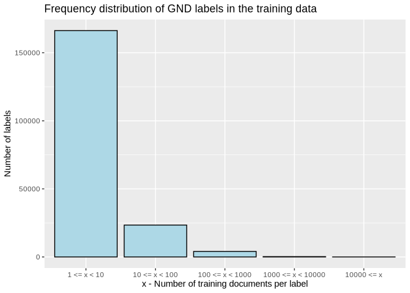
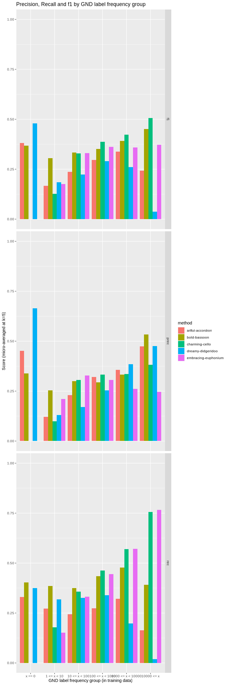
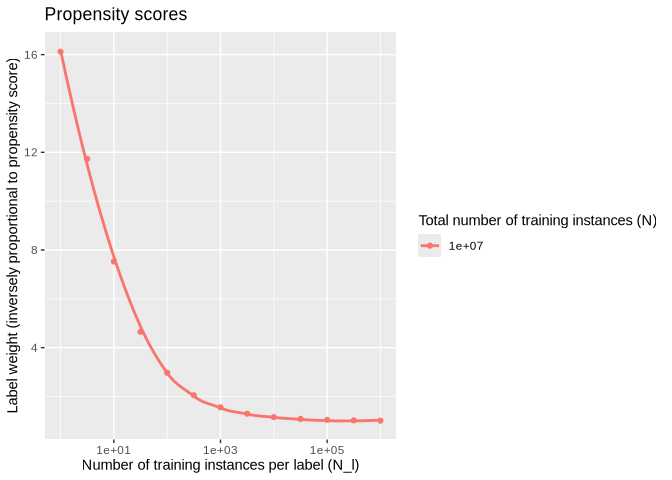
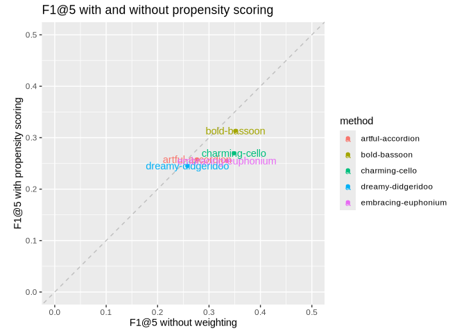

# Workbook 5: Analysing the long-tail
Maximilian Kähler, DNB

- [Analyse performance by label frequency, binned frequency
  groups](#analyse-performance-by-label-frequency-binned-frequency-groups)
- [Your turn](#your-turn)
- [Bonus: Propensity Scoring](#bonus-propensity-scoring)
  - [Conditional label weights](#conditional-label-weights)
  - [Your turn](#your-turn-1)
- [References](#references)

So far, we have mainly focused on evaluating the overall performance of
different methods for subject indexing. However, in practice, it is
often the case that some subjects are much more frequent than others.

The following picture shows the frequency distribution of GND labels in
the training data.

``` r
# compute binned frequency groups
freq_groups <- train_freqs  |>               
                mutate(freq_group = cut(x = label_freq,
                          breaks = c(0, 1, 10, 100, 1000, 10000, Inf),
                          labels = c("x == 0",
                                     "1 <= x < 10",
                                     "10 <= x < 100",
                                     "100 <= x < 1000",
                                     "1000 <= x < 10000",
                                     "10000 <= x"
                          ),
                          right = FALSE, include_lowest = TRUE))  |>
                  select(-label_freq)

# count labels along frequency groups
count_freq_groups <- freq_groups |> 
  # remove zero-shot predictions
  filter(freq_group != "x == 0") |>
  group_by(freq_group) |> 
  summarise(n_labels = n()) 

# visualize frequency distribution
ggplot(count_freq_groups, aes(x = freq_group, y = n_labels)) + 
  geom_col(fill = "lightblue", color = "black") +
  labs(
    title = "Frequency distribution of GND labels in the training data",
    x = "x - Number of training documents per label",
    y = "Number of labels"
  )
```



The overwhelming majority of labels in the training data are very
infrequent, i.e., they occur less than 10 times. This is a common
phenomenon in subject indexing and is often referred to as the
“long-tail” problem. It is quite common that indexing methods perform
well on frequent labels, but struggle with infrequent ones. However,
infrequent labels are often very important for the precise description
of documents, whereas frequent labels tend to be more general and less
informative. In the following, we will analyse how well the different
methods perform on labels of different frequencies.

## Analyse performance by label frequency, binned frequency groups

We already learned in workbook 02 how to stratify set retrieval metrics
by groups defined in the label space. We now use the same method, but
use the freq_groups derived from the training distribution above.

``` r
# iterate over all methods and compute set retrieval scores
# with binned frequency groups
res_by_train_freq <- map_dfr(
  predictions,
  ~ compute_set_retrieval_scores(
    predicted = .x,
    gold_standard = gold_standard,
    # micro-averages work best for stratification along label groups
    mode = "micro", 
    k = 5,
    label_groups = freq_groups # use frequency groups defined above
  ),  .id = "method"
)
```

We can visualize that in a plot:

``` r
# plot precision, recall and f1 by frequency group and method
res_by_train_freq |> 
  filter(metric != "rprec", freq_group != "NA")  |>
  ggplot(aes(x = freq_group, y = value, fill = method)) + 
    geom_bar(stat = "identity", position = "dodge") +
    ylim(0, 1) +
    facet_grid(rows = vars(metric)) + 
    labs(
      title = "Precision, Recall and f1 by GND label frequency group",
      x = "GND label frequency group (in training data)",
      y = "Score (micro-averaged at k=5)"
    )
```



## Your turn

Based on the plot above, answer the following questions:

- Which method performs best on infrequent labels (1-10 training
  instances)?
- Which method performs best on frequent labels (\>1000 training
  instances)?

## Bonus: Propensity Scoring

Above analysis shows huge differences between the methods and strata of
frequency groups. However, it is difficult to summarize this
information. An alternative to a stratified analysis along the frequency
groups is to work with **weighted** labels. Going by the assumption that
less frequent labels hold more specific information and thus are of
higher importance, we will now define label weights that are inversly
proportional to the label frequency.

The precise formula for computing the weights is taken from (Jain,
Prabhu, and Varma 2016) and is based on the concept of propensity
scoring. You can skip the details of the formula in the box below, but
feel free to expand it if you are interested.

<div class="panel-tabset">

#### More about propensity scores

<details>

<summary>

Click to expand explanation of propensity scores
</summary>

Can we assume that annotations in our gold standard are complete? Many
subject ontologies like the GND or LSCH have hundreds of thousands of
labels, but documents are usually only annotated with a handful of them.
It is quite likely that an annotator is not aware of all possible
relevant labels. This is especially true for untrained annotators. Jain,
Prabhu, and Varma (2016) argue the same and propose to model the
incompleteness of the gold standard by introducing propensity scores for
each label $\lambda$. The propensity score $p_{\lambda}$ models the
probability that a relevant label $\lambda$ is actually annotated,
assuming it should be annotated (this is called a marginal probability).
Jain et al. propose the following formula for modeling the propensity
score:
$$p_{\lambda} = \frac{1}{1 + C\cdot exp(-A\cdot log(N_{\lambda} + B))}$$

Here, $N_{\lambda}$ is the number of training instances for label
$\lambda$, and $A$, $B$ are hyperparameters that can be tuned. $C$ is a
constant that depends on the total number of training instances $N$ (the
entire training set size).

The following plot shows the relationship between label frequency and
the corresponding label weight (inversly proportional to the propensity
score).

``` r
# define range of label frequencies to compute propensity scores for
N_l <- 10^seq(0,6,0.5)

# function to compute propensity scores
# N_l: number of training instances per label
# N: total number of training instances
# A, B: hyperparameters
p_l <- function(N_l, N = 3e6, A = 0.55, B = 1.5)
 {
  C <- (log(N) - 1)*(B + 1)^A
  p_l <- 1/(1 + C*exp(-A*log(N_l + B)))
  
  return(p_l)
}

# create data frame for plotting
df <- expand.grid(
  N_l = N_l,
  N = c(1e7)
) %>% 
rowwise() %>% 
  mutate(p_l = p_l(N_l, N))

# plot label weights (inversly proportional to propensity scores)
ggplot(df, aes(x = N_l, y = 1/p_l, color = factor(N))) + 
  geom_point() + 
  geom_smooth(se = FALSE) + 
  scale_x_log10() + 
  scale_color_discrete() + 
  labs(
    title = "Propensity scores",
    x = "Number of training instances per label (N_l)",
    y = "Label weight (inversely proportional to propensity score)",
    color = "Total number of training instances (N)"
  )
```



Rare labels receive much higher weights than frequent ones.

</details>

</div>

We will now use these label weights to compute weighted set retrieval
metrics that emphasize the performance on infrequent labels. CASIMiR
takes an additional argument `propensity_scored = TRUE` in the function
`compute_set_retrieval_scores()` (and also for the functions
`compute_pr_auc()` and `compute_pr_curve()`). This will require that you
also pass a data frame with the label distribution in the training data
(as we have already loaded above in `train_freqs`).

``` r
res_propensity <- map_dfr(
  predictions,
  ~ compute_set_retrieval_scores(
    predicted = .x,
    gold_standard = gold_standard,
    mode = "doc-avg",
    k = 5,
    propensity_scored = TRUE,
    label_distribution = train_freqs,
    rename_metrics = TRUE
  ),  .id = "method"
)
```

The following table shows the results, where ps-f1@5 denotes the
propensity scored f1@5 score.

``` r
res_propensity  |>
  filter(metric == "ps-f1@5")  |>
  kable(caption = "Propensity scored f1@5 scores by method")
```

| method              | metric  | mode    | value | support |
|:--------------------|:--------|:--------|------:|--------:|
| artful-accordion    | ps-f1@5 | doc-avg | 0.245 |    8415 |
| bold-bassoon        | ps-f1@5 | doc-avg | 0.331 |    8415 |
| charming-cello      | ps-f1@5 | doc-avg | 0.292 |    8415 |
| dreamy-didgeridoo   | ps-f1@5 | doc-avg | 0.237 |    8415 |
| embracing-euphonium | ps-f1@5 | doc-avg | 0.312 |    8415 |

Propensity scored f1@5 scores by method

### Conditional label weights

When we look at the errors an indexing algorithm makes we usually think
of false positive and false negatives. Do they mean the same to us? If
not, arguably, one might introduce what is called a “custom loss
function”

|  | Goldstandard yes | Goldstandard no |
|----|----|----|
| **Prediction yes** | $C_{\text{tp}}\cdot \text{tp}$ | $C_{\text{fp}}\cdot\text{fp}$ |
| **Prediction no** | $C_{\text{fn}}\cdot\text{fn}$ | $C_{\text{tn}}\cdot\text{tn}$ |

with some custom weights assigned to each category
$C_{\text{tp}}, C_{\text{fp}}, C_{\text{fn}}, C_{\text{tn}}$. True
negatives are never intresting in subject indexing, so lets ignore
$C_{\text{tn}}$. Now, arguably, having a false positive prediction,
i.e. having a document incorrectly labeled, should be punished
irrespective of the label frequency. Having a wrong frequent label is
just as bad as having a wrong infrequent label. However, when it comes
to false negatives, i.e. missing a label that should have been assigned
to a document, we might want to weight missing infrequent labels higher
than missing frequent labels, still holding to the assumption that
infrequent labels are more specific and informative. Same goes for true
positives: we want to reward the correct assignment of infrequent labels
higher than the correct assignment of frequent labels. So we assume the
following costs: $$C_{\text{tp}} = C_{\text{fn}} = w_{\lambda},$$ (with
$w_{\lambda}$ the label weight derived from the propensity score as
$1/p_{\lambda}$) and $C_{\text{fp}} = \textit{const}$.

CASIMiR supports this by allowing to pass a constant cost for false
positives. It provides some predefined strategies for setting this
constant via the argument `cost_fp_constant =` that can take the
following values:

- `"mean"`: mean of the gold-standard label weights
- `"max"`: maximum of the gold-standard label weights
- `"min"`: minimum of the gold-standard label weights
- numeric value: a custom numeric value

``` r
res_propensity <- map_dfr(
  predictions,
  ~ compute_set_retrieval_scores(
    predicted = .x,
    gold_standard = gold_standard,
    mode = "doc-avg",
    k = 5,
    propensity_scored = TRUE,
    label_distribution = train_freqs,
    cost_fp_constant = "mean",
    rename_metrics = TRUE
  ),  .id = "method"
)

res_propensity  |>
  filter(metric == "ps-f1@5")  |>
  kable(caption = "Propensity scored f1@5 scores by method with constant false positive cost")
```

| method              | metric  | mode    | value | support |
|:--------------------|:--------|:--------|------:|--------:|
| artful-accordion    | ps-f1@5 | doc-avg | 0.258 |    8415 |
| bold-bassoon        | ps-f1@5 | doc-avg | 0.313 |    8415 |
| charming-cello      | ps-f1@5 | doc-avg | 0.270 |    8415 |
| dreamy-didgeridoo   | ps-f1@5 | doc-avg | 0.245 |    8415 |
| embracing-euphonium | ps-f1@5 | doc-avg | 0.255 |    8415 |

Propensity scored f1@5 scores by method with constant false positive
cost

We can observe that `charming-cello` and `embracing-euphonium`, among
the top notch in workbook 1, come closer to the other methods, whereas
`bold-bassoon` still stands out as the best method.

### Your turn

- compare the results of the propensity scored metrics with the results
  stratified by frequency groups above. Do they tell a similar story?
- use the argument `cost_fp_constant =` to manipulate the false positive
  cost. Try different strategies and observe the changes in the results.
- compare the results with the standard (non-propensity scored) metrics:
  How do the rankings of the methods change? Use the following code
  snippet to help you with the comparison:



## References

<div id="refs" class="references csl-bib-body hanging-indent"
entry-spacing="0">

<div id="ref-PfastreXML" class="csl-entry">

Jain, Himanshu, Yashoteja Prabhu, and Manik Varma. 2016. “Extreme
Multi-Label Loss Functions for Recommendation, Tagging, Ranking and
Other Missing Label Applications.” In *Proceedings of the 22nd ACM
SIGKDD International Conference on Knowledge Discovery and Data Mining*,
13-17-Augu:935–44. ACM. <https://doi.org/10.1145/2939672.2939756>.

</div>

</div>
