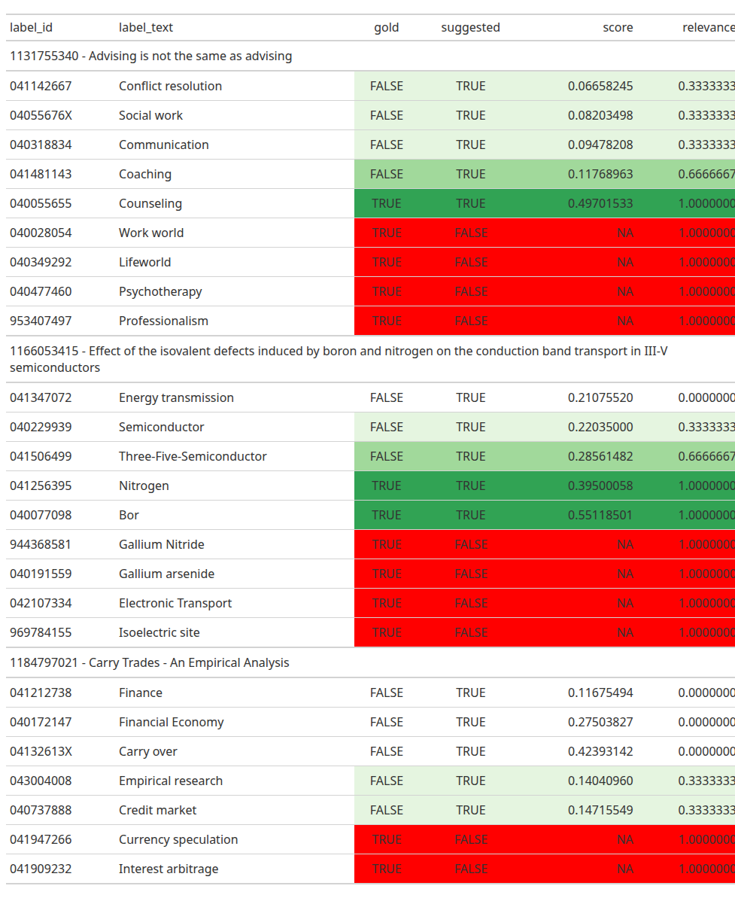

# Workbook 7 (Bonus): Evaluating Graded Relevance Ratings
Maximilian Kähler, DNB

- [Datasets](#datasets)
  - [Your turn:](#your-turn)
- [Graded Relevance Metrics](#graded-relevance-metrics)
- [Computing Graded Relevance Metrics with
  CASIMiR](#computing-graded-relevance-metrics-with-casimir)
  - [Your turn](#your-turn-1)

In this bonus workbook we will explore how to evaluate graded relevance
ratings using the CASIMiR package. Graded relevance ratings are useful
when you want to capture more nuanced judgments about the relevance of
subject terms beyond a simple binary relevant/ not relevant distinction.
In binary relevance comparison, we often find false postives that are
not entirely wrong. Also manual indexers can have some interrater
disagreement, so that annotations are not always black and white. Graded
relevance ratings allow us to capture these nuances by assigning
different levels of relevance to machine based subject terms. This is
the form of evaluation that comes with the highes cost, as it requires
subject experts to manually rate the relevance of each suggested subject
term.

## Datasets

In this workbook we use a different pair of data files for each method.
For each method we have

- a file of predicted subject terms along with graded relevance ratings
  (assigned by subject experts) and
- a gold standard file with binary relevance labels (which also capture
  false negatives).

The graded relevance ratings are on an ordinal scale from 0 to 3:

- 0: not relevant/ wrong
- 1: slightly helpful
- 2: helpful
- 3: very helpful

Where helpful means that the subject term would be useful for a user to
find the document for retrieval purposes. To calculate metrics from
these ordinal ratings, we map them to metric relevance levels $r$
between 0 and 1 as follows:

| Ordinal Relevance Level | Metric Relevance Level $r$ |
|-------------------------|----------------------------|
| very helpful            | 1                          |
| helpful                 | 2/3                        |
| slightly helpful        | 1/3                        |
| wrong                   | 0                          |

Let’s take a look at how the data looks like for one of the methods,
e.g. “bold-bassoon”.

``` r
method_name <- "bold-bassoon"

preds <- predictions_w_relevance[[method_name]] 
gold <- gold_standards[[method_name]]
set.seed(681)
documents <- predictions_w_relevance[[method_name]] |> 
  distinct(doc_id) |>
  sample_n(3)

example_table <- create_qualitative_table_single_model(
    predicted = predictions_w_relevance[[method_name]],
    gold_standard = gold_standards[[method_name]],
    doc_id_list = documents,
    title_texts = select(doc_titles, doc_id, title = doc_title_eng),
    gnd = select(gnd, label_id, label_text = label_text_eng),
    graded_relevance = TRUE
) |> 
  group_by(doc_id, title_text)  |> 
  arrange(doc_id, gold, relevance) 
```



### Your turn:

- alter the seed in `set.seed()` to see more examples
- try it out with other methods by changing the method name in the code
  above

## Graded Relevance Metrics

It is possible to generalise the binary relevance metrics like precision
and recall to graded relevance ratings (Kekäläinen and Järvelin 2002).

**Generalised Precision**

$$
\mathrm{gPrec} := \frac{tp + \Delta_{rel}}{tp + fp}
$$

**Generalised Recall**

$$
\mathrm{gRec} := \frac{tp + \Delta_{rel}}{tp + fn + \Delta_{rel}}
$$

with $\Delta_{rel} = \sum_{i \in false\ positives} r_i$ with metric
relevance ratings $0 \leq r_i \leq 1$

## Computing Graded Relevance Metrics with CASIMiR

CASIMiR also provides functions to compute graded relevance metrics.
Actually, you already know the `compute_set_retrieval_scores()` function
from workbook 2. It can also handle graded relevance ratings if you set
the `graded_relevance` argument to `TRUE`. This assumes that `predicted`
contains a `relevance` column with graded relevance ratings.

The following example shows how to compute graded relevance metrics for
the “bold-bassoon” method.

``` r
res <- compute_set_retrieval_scores(
  predicted = predictions_w_relevance[["bold-bassoon"]],
  gold_standard = gold_standards[["bold-bassoon"]],
  graded_relevance = TRUE,
  k = 5,
  rename_metrics = TRUE # adds prefix "g-" to metric names
) 

kable(
  res,
  digits = 3,
  caption = "Graded relevance metrics for bold-bassoon"
)
```

| metric    | mode    | value | support |
|:----------|:--------|------:|--------:|
| g-f1@5    | doc-avg | 0.567 |    1132 |
| g-prec@5  | doc-avg | 0.592 |    1132 |
| g-rec@5   | doc-avg | 0.579 |    1132 |
| g-rprec@5 | doc-avg | 0.669 |    1132 |

Graded relevance metrics for bold-bassoon

We can now iterate this over all methods like we did in workbook 2.

``` r
res_all_methods <- map2_dfr(
  predictions_w_relevance,
  gold_standards,
  ~ compute_set_retrieval_scores(
    predicted = .x,
    gold_standard = .y,
    graded_relevance = TRUE,
    k = 5,
    rename_metrics = TRUE
  ),
  .id = "Method"
) |> 
  select(-support) |> 
  pivot_wider(
    names_from = metric,
    values_from = value
  ) 

kable(
  res_all_methods,
  digits = 3,
  caption = "Graded relevance metrics for all methods (k = 5)"
)
```

| Method              | mode    | g-f1@5 | g-prec@5 | g-rec@5 | g-rprec@5 |
|:--------------------|:--------|-------:|---------:|--------:|----------:|
| bold-bassoon        | doc-avg |  0.567 |    0.592 |   0.579 |     0.669 |
| charming-cello      | doc-avg |  0.495 |    0.505 |   0.530 |     0.601 |
| dreamy-didgeridoo   | doc-avg |  0.423 |    0.427 |   0.461 |     0.517 |
| embracing-euphonium | doc-avg |  0.462 |    0.484 |   0.484 |     0.565 |

Graded relevance metrics for all methods (k = 5)

**Note:** Workbook 2 was on a different dataset and here all methods
were tested on their own dataset. So the results are not directly
comparable.

### Your turn

- compare the results with the binary relevance metrics
- can you compute a graded relevance precision recall curve?

<div id="refs" class="references csl-bib-body hanging-indent"
entry-spacing="0">

<div id="ref-Kekalainen2002" class="csl-entry">

Kekäläinen, Jaana, and Kalervo Järvelin. 2002. “Using Graded Relevance
Assessments in IR Evaluation.” *Journal of the American Society for
Information Science and Technology* 53 (November): 1120–29.
<https://doi.org/10.1002/asi.10137>.

</div>

</div>
